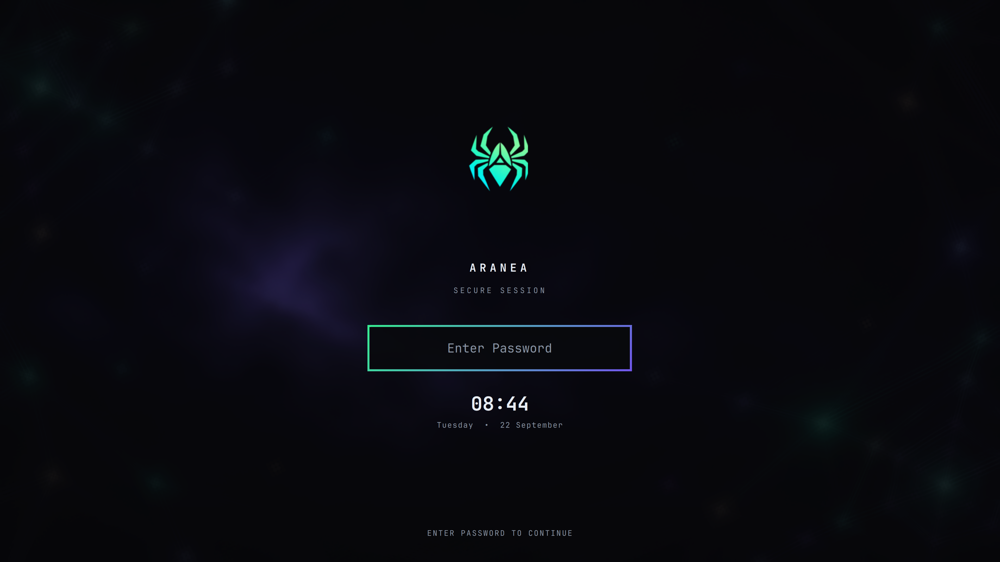

<div align="center">

# Aranea

**A quiet, obsidian Omarchy desktop with a living spider mark.**

An Omarchy theme by [AraneaDev](https://aranea-development.nl), built around
deep black surfaces, mint light, violet focus states, and a restrained network
wallpaper.

[Omarchy](https://omarchy.org) · [AraneaDev](https://aranea-development.nl)

</div>


## The experience

Aranea carries one visual language from boot to desktop:

- **Obsidian surfaces** — low-noise dark backgrounds with readable muted text.
- **Mint and violet signal** — mint for activity, violet for focus and depth.
- **Spider identity** — the AraneaDev mark appears in the wallpaper, bar,
  lock screen, idle branding, fastfetch, and Plymouth.
- **Transparent shell bar** — the wallpaper remains visible behind the bar;
  widgets stay compact and interactive.
- **Useful motion, little noise** — notifications, panels, and diagnostics are
  available when needed and stay out of the way when they are not.

## Install

Install the theme through Omarchy, then select it:

```bash
omarchy theme install https://github.com/AraneaDev/omarchy-aranea-theme.git
omarchy theme set aranea
```

Install the theme hooks so the shell plugins, GTK links, and diagnostics helper
follow theme changes:

```bash
omarchy hook install theme-set hooks/theme-set
omarchy hook install post-boot hooks/post-boot
omarchy theme set aranea
```

The shell layout lives in `~/.config/omarchy/shell.json`. The supplied setup
keeps the spider menu and workspaces on the left, the clock and indicators in
the center, and system controls on the right.

## Interactive shell

The bar is transparent and remains fully interactive:

- Click the **spider** to open the Omarchy command menu.
- Right-click the spider to open a terminal.
- Click workspaces to switch sessions.
- Click the center indicators for idle/screensaver and status controls.
- Click the network, audio, Bluetooth, monitor, power, tray, and agent widgets
  to open their native panels.

The custom bar preserves Omarchy's normal widget and popup behavior while
adding Aranea's layout, spider menu mark, and visual restraint.

## Screens

The screenshots below are fresh captures from the installed theme.

### Desktop

Transparent bar, centered indicators, workspaces, system controls, and the
ambient network wallpaper.


### Command menu

The spider opens the familiar Omarchy command surface without leaving the
Aranea visual system.


### Notifications

Critical notifications use a finite, high-visibility treatment so routine web
alerts do not remain on screen forever.


### Diagnostics

The optional Conky layer is available on demand for a clean system overview.


### Lock screen and boot identity

The lock surface centers the corrected spider mark above the secure-session
prompt, with the same identity carried into Plymouth.



## Palette

| Role | Value |
| --- | --- |
| Background | `#08090b` |
| Mint accent | `#3bff9e` |
| Violet accent | `#7a5cff` |
| Foreground | `#e7ecf3` |
| Muted foreground | `#8b96a6` |

The source palette is in [`colors.toml`](colors.toml); shell-specific surface
tokens are in [`shell.toml`](shell.toml).

## Optional diagnostics

Conky is intentionally not started during login. Toggle it when you want the
system panel:

```bash
aranea-diagnostics-toggle
```

The supplied Hyprland binding is `SUPER + CTRL + SHIFT + D`. The diagnostics
layer requires a Conky build with real Wayland layer-shell support, such as
`conky-cairo-wayland-git` from the AUR.

## Branding and files

- `backgrounds/` — coordinated day and night wallpapers.
- `branding/` — fastfetch and idle screensaver marks.
- `unlock.png` — shared spider asset for the bar, lock screen, and boot flow.
- `plugins/araneadev.bar/` — transparent interactive bar composition.
- `plugins/araneadev.menu/` — spider menu widget and command menu.
- `plugins/araneadev.lock/` — Aranea lock surface with native PAM handling.
- `plugins/araneadev.notifications/` — finite critical notification treatment.
- `hooks/` — theme-set and post-boot integration.

## License

See the repository's upstream project and asset licenses before redistributing
modified branding or wallpapers.
