<div align="center">

# Aranea

**A quiet, obsidian Omarchy desktop with a living network of light.**

Deep black surfaces, mint activity, violet focus, atmospheric wallpapers, and
the AraneaDev mark carried consistently from boot to desktop.

[Omarchy](https://omarchy.org) · [AraneaDev](https://aranea-development.nl)

</div>

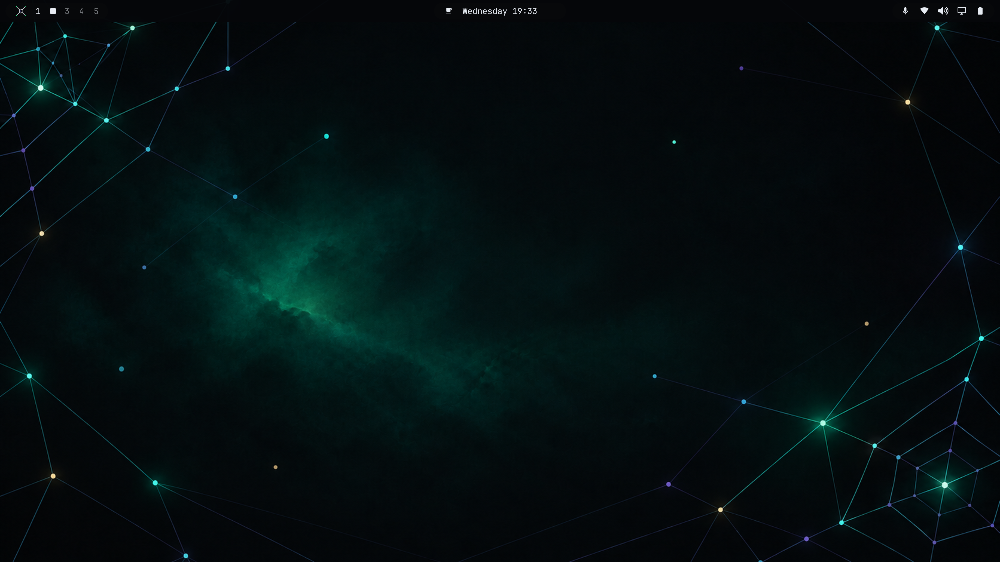

## What it feels like

Aranea is designed as one calm visual system rather than a collection of
unrelated tweaks:

- transparent, interactive shell bar with spider menu and native controls;
- obsidian surfaces with mint activity states and violet focus states;
- day, night, and atmospheric wallpaper variants built around edge topology;
- matching lock, idle, boot, terminal, editor, browser, cursor, and media art;
- optional diagnostics and application integrations that stay out of the way.

The wallpaper is intentionally mark-free. The spider identity belongs to the
bar, menus, lock screen, boot splash, idle branding, and fastfetch surfaces.

## Install

From a checkout:

```bash
./scripts/install.sh
```

For a non-interactive full install:

```bash
./scripts/install.sh --yes
```

The installer installs Aranea, registers the theme hooks, installs the managed
integrations, and offers the optional Wayland Conky package when `paru` or
`yay` is available. It does not start Conky automatically.

Choose an installation profile when needed:

```bash
./scripts/install.sh --profile minimal --yes
./scripts/install.sh --profile full --yes
./scripts/install.sh --profile no_apps --yes
```

To install the exact checkout you are testing instead of fetching the default
remote repository, pass a local source explicitly:

```bash
./scripts/install.sh --source "$PWD" --yes --skip-conky
```

If installation fails after a previous theme was detected, the installer prints
the exact `omarchy theme set ...` command needed to restore it.

`minimal` keeps the core and GTK experience, `full` enables every supported
application integration, and `no_apps` keeps the theme, cursor, wallpaper, and
branding assets without application integrations. The selected profile is
stored in `~/.local/state/aranea/profile`.

Preview or diagnose without changing the system:

```bash
./scripts/install.sh --dry-run --yes
./scripts/aranea-doctor --json
```

## Activate

After installation, select the theme and a wallpaper with Omarchy:

```bash
omarchy theme set aranea
./scripts/aranea-wallpaper list
./scripts/aranea-wallpaper set day
```

The wallpaper picker also exposes `night`, `sparse`, `dense`, `dusk`,
`monochrome`, and `ultrawide`. The bar remains transparent so the network art
can breathe behind it.

The command menu uses a hybrid command-center layout: the root view adds
Aranea identity, fixed Files and Terminal tiles, and a favorite/recent action;
submenus retain a compact mark and breadcrumb. The primary, reduced, and
ceremony marks live under [`branding/marks`](branding/marks/aranea-primary.svg)
alongside their reduced and ceremony variants. Shared ready/active/attention
state glyphs and the menu’s network, node, and edge motifs live under
[`branding/glyphs`](branding/glyphs/ready.svg) and
[`branding/motifs`](branding/motifs/menu-network.svg).

## Artwork

### Desktop and shell


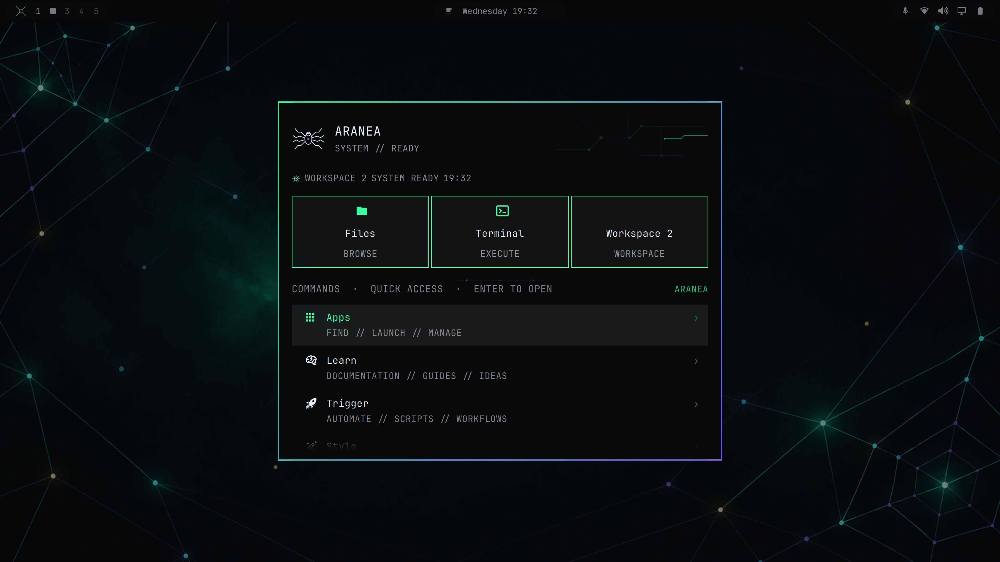

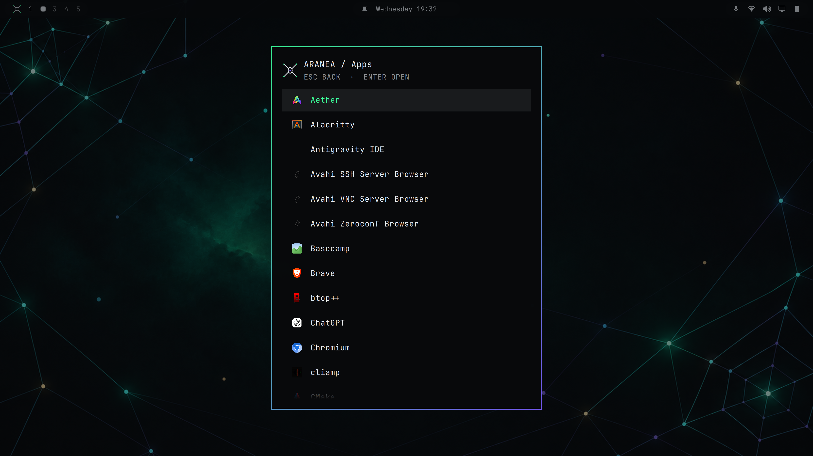

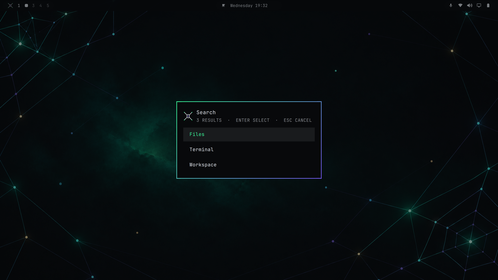

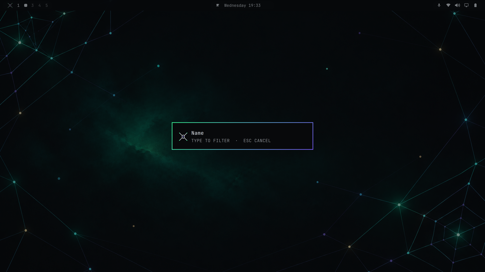

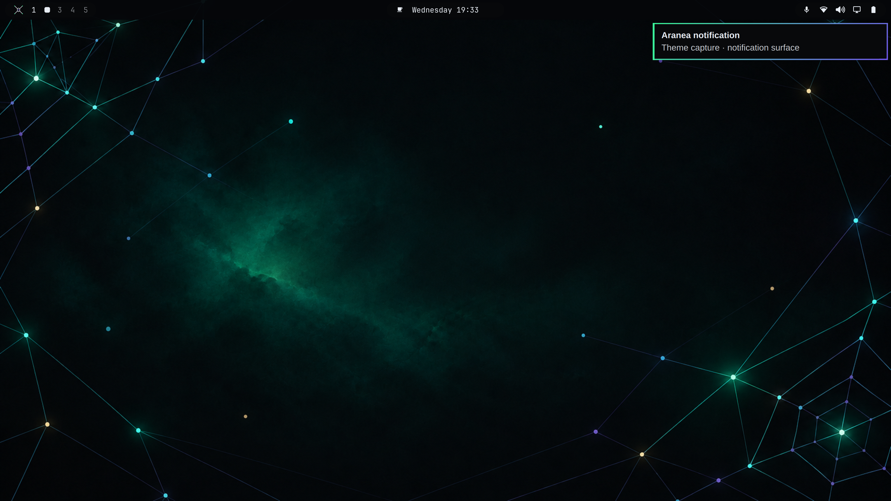

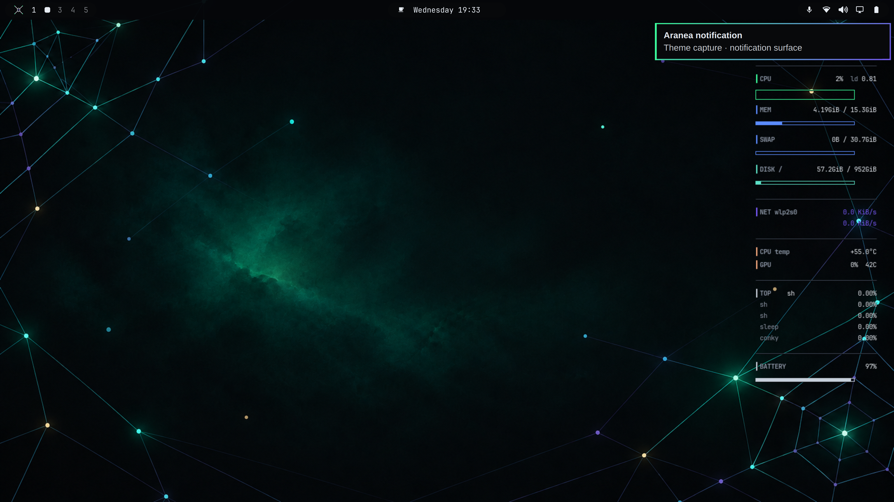

### Wallpaper collection

The original day/night pair is the visual anchor for the collection. The
variants keep its smoky nebula texture, luminous nodes, edge-weighted topology,
and readable center while changing density, color, contrast, or aspect ratio.

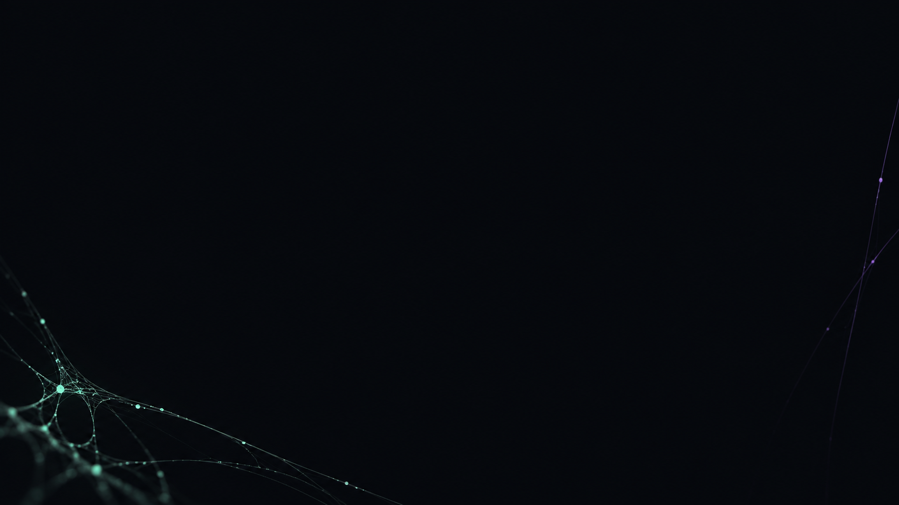


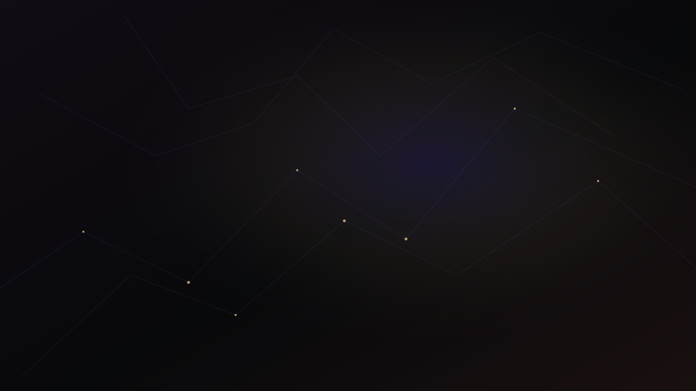

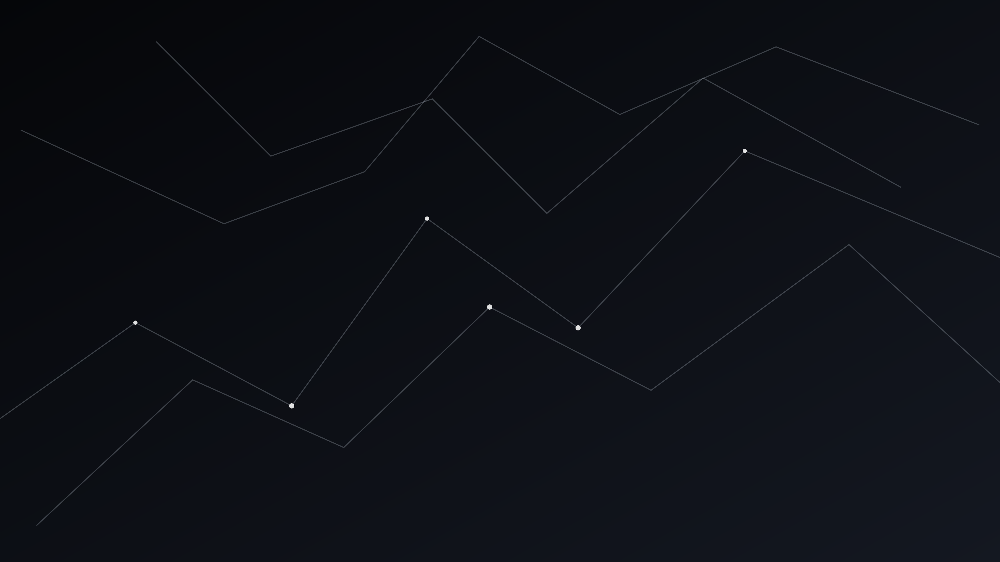

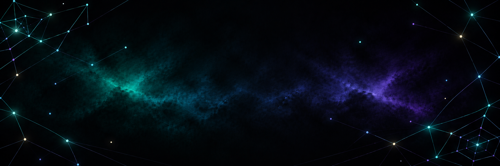


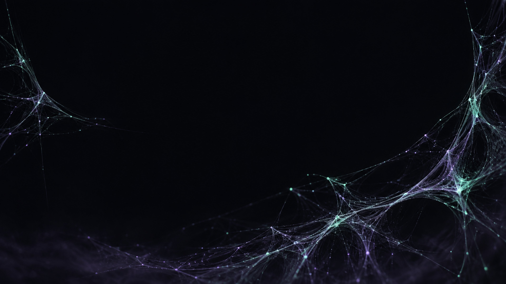

### Secure and boot surfaces

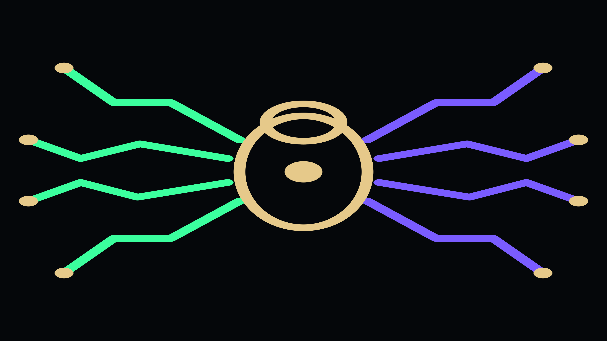

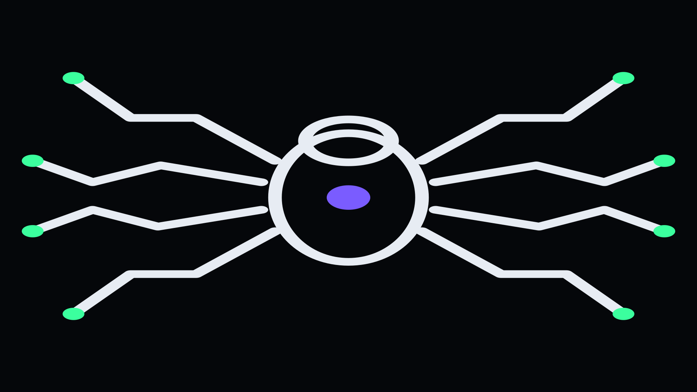

Apply the boot splash separately; rebuilding the initramfs requires `sudo`:

```bash
omarchy plymouth set-by-theme aranea
```

### Application surfaces

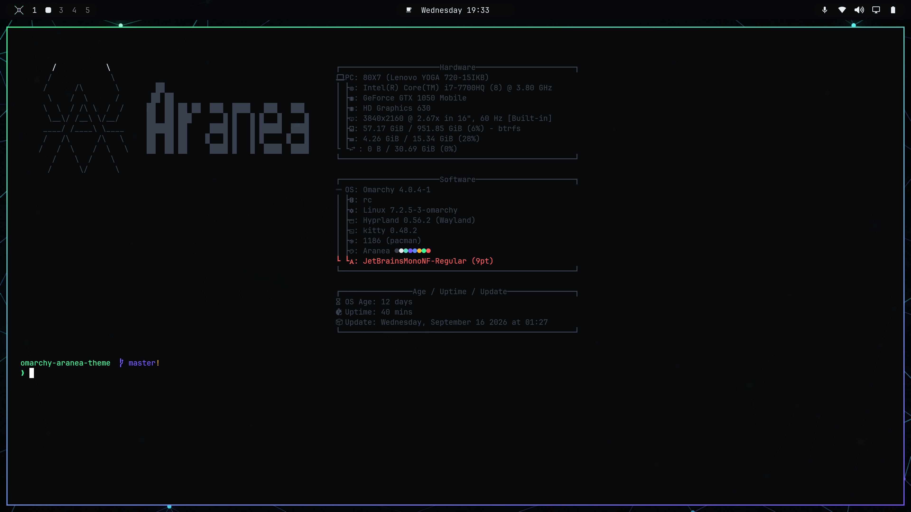

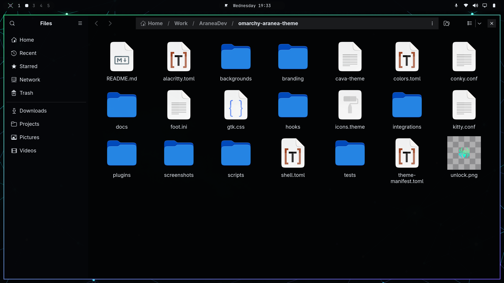

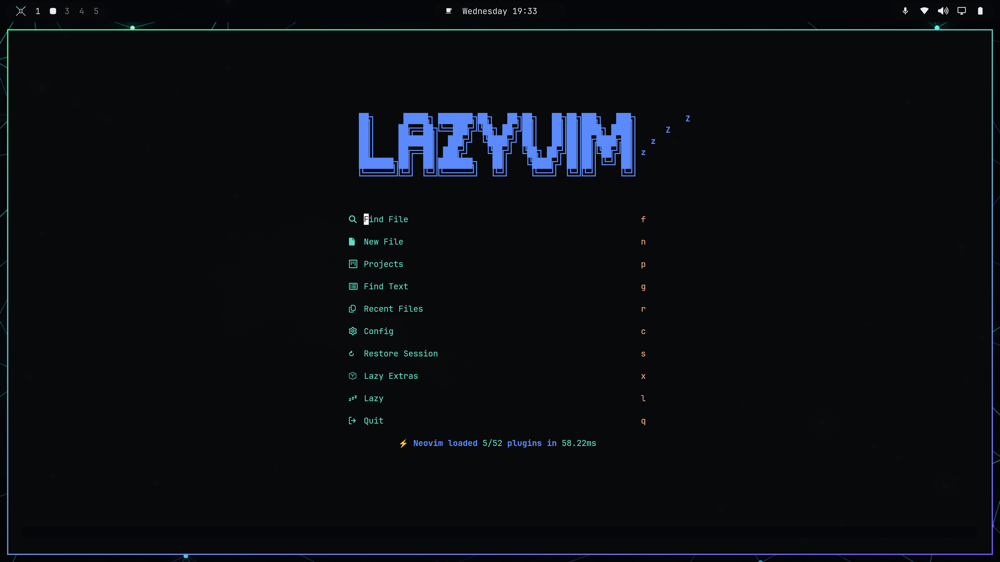

Refresh the complete README capture set in one pass. Menu, desktop,
notification, diagnostics, and application surfaces are captured from the
running session; lock and Plymouth use canonical artwork renders:

```bash
./scripts/capture-screenshots --all --output screenshots
```

Lock and Plymouth entries use the canonical ceremony and primary artwork,
rendered into the README capture set without locking or rebooting the session.

The repository also ships matching Cava, browser/session, Qt, icon, and cursor
integrations. The cursor artwork is inspectable directly:


## Interaction

- Click the spider to open the Omarchy command menu.
- Right-click the spider to open a terminal.
- Click workspaces to switch sessions.
- Use the center indicators for idle and status controls.
- Use the right-side widgets for network, audio, Bluetooth, displays, power,
  tray, and agent controls.

The optional diagnostics layer can be toggled with:

```bash
aranea-diagnostics-toggle
```

The supplied Hyprland binding is `SUPER + CTRL + SHIFT + D`. It requires a
Wayland layer-shell Conky build such as `conky-cairo-wayland-git`.

## Palette

| Role | Value |
| --- | --- |
| Background | `#08090b` |
| Mint accent | `#3bff9e` |
| Violet accent | `#7a5cff` |
| Foreground | `#e7ecf3` |
| Muted foreground | `#8b96a6` |

The source tokens are in [`colors.toml`](colors.toml) and
[`shell.toml`](shell.toml). Wallpaper metadata and stable picker IDs are in
[`backgrounds/manifest.toml`](backgrounds/manifest.toml).

## Repository map

- `backgrounds/` — day/night artwork and the named wallpaper collection.
- `branding/` — fastfetch and idle screensaver marks.
- `integrations/` — terminal, editor, browser, cursor, Qt, media, session, and
  icon integrations.
- `plugins/` — the Aranea bar, menu, lock, and notification surfaces.
- `hooks/` — theme activation and post-boot integration hooks.
- `scripts/` — installer, diagnostics, wallpaper, showcase, and health tools.
- `screenshots/` — representative captures used throughout this README.

## License

See the repository's upstream project and asset licenses before redistributing
modified branding or wallpapers.
