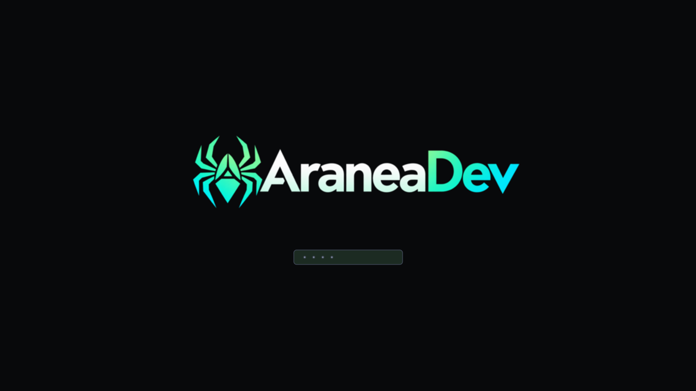
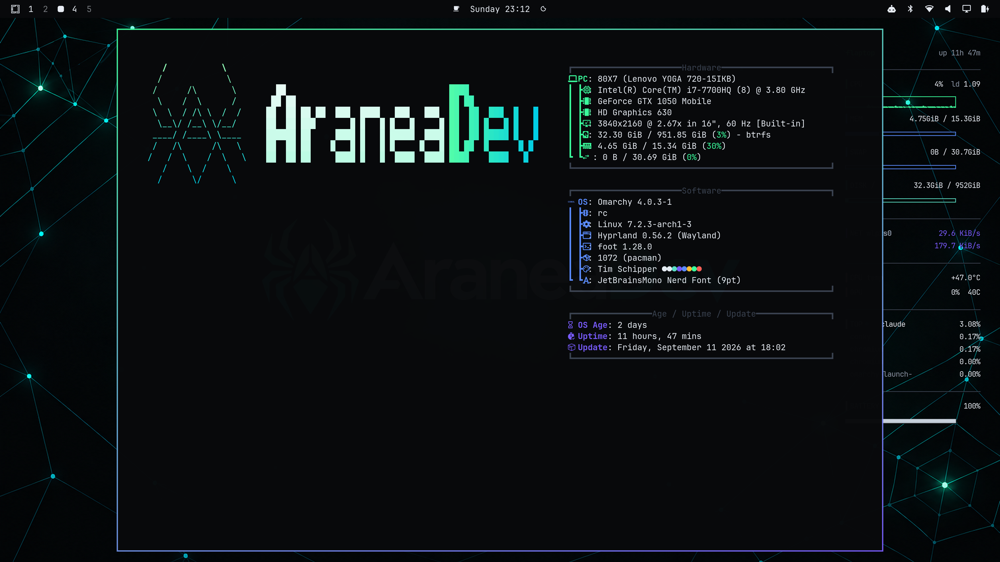
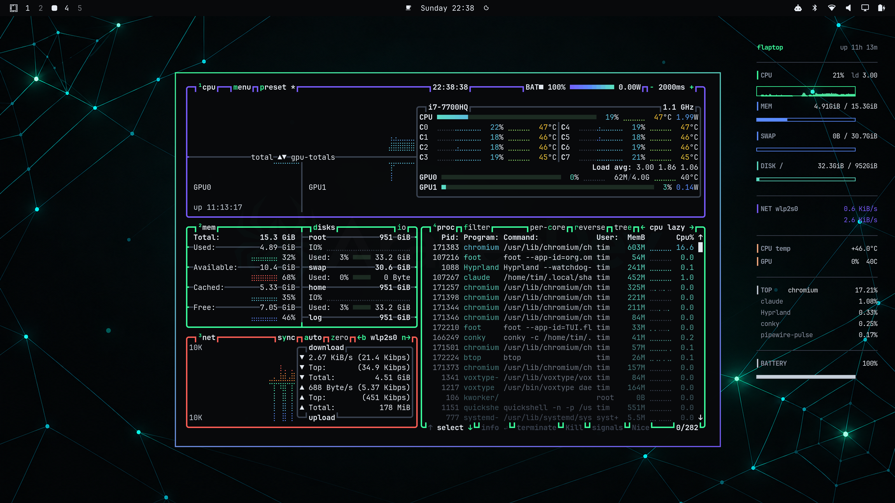
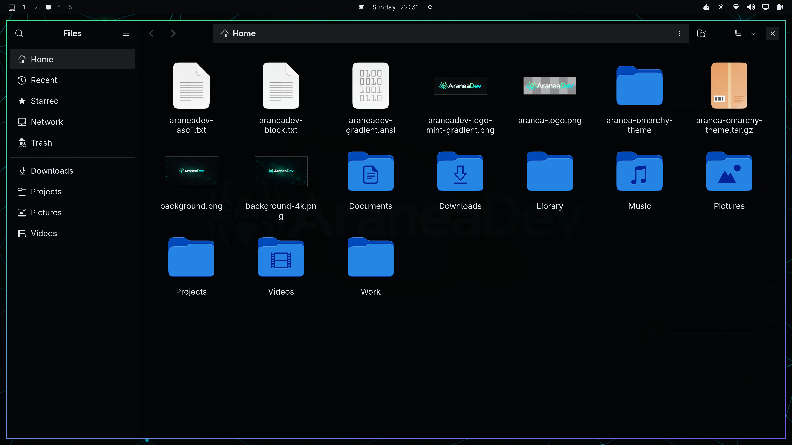
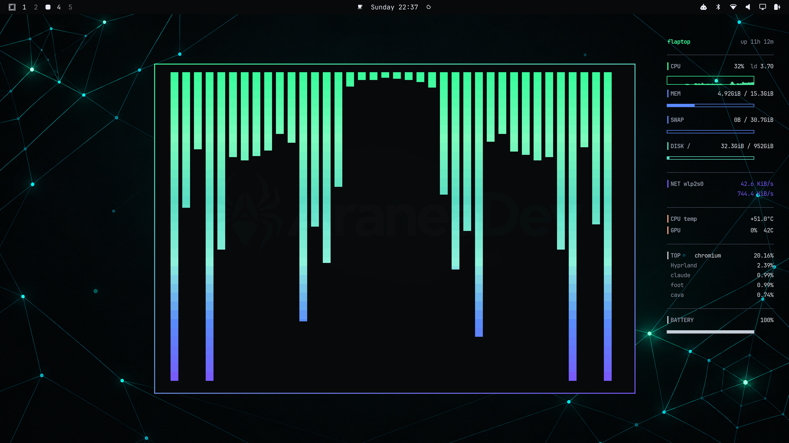
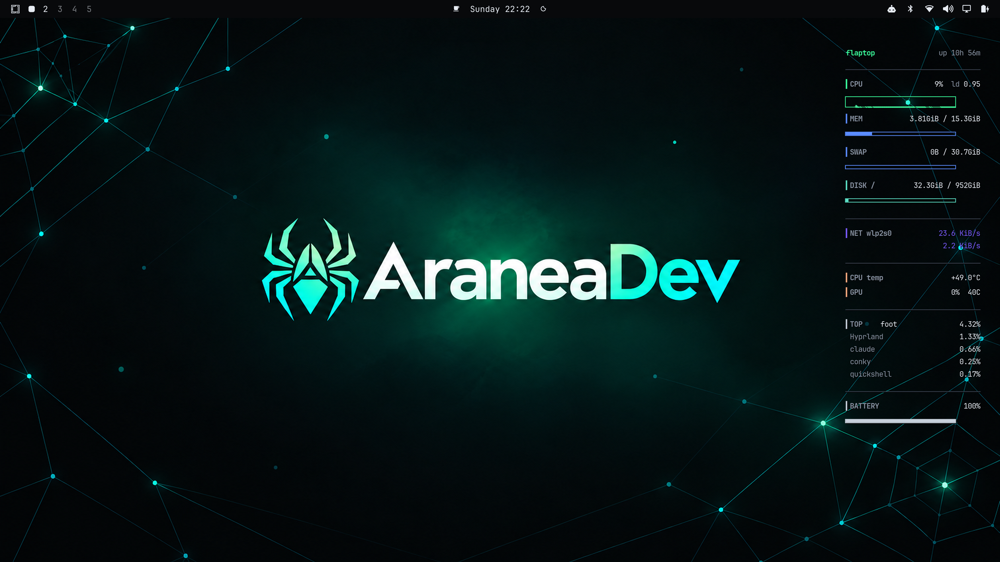

# Aranea

An [Omarchy](https://omarchy.org) theme forked from the stock `hackerman` theme,
recolored to match [tim-schipper.nl](https://tim-schipper.nl)'s exact palette,
with the **AraneaDev** spider-and-wordmark logo carried through the wallpaper,
fastfetch, idle screensaver, lock screen, and Plymouth boot screen.


## Palette

| Role               | Hex       |
|--------------------|-----------|
| Background         | `#08090b` |
| Accent (mint)       | `#3bff9e` |
| Accent 2 (violet)   | `#7a5cff` |
| Foreground          | `#e7ecf3` |
| Muted foreground    | `#8b96a6` |

Both accents show up across the terminal/GTK/conky theming; the fastfetch
logo itself is single-color (see Branding below) so its auto-fit sizing
keeps working natively.

## Wallpaper

`backgrounds/background-4k.png` — a true 4K (3840×2160) render of the site's
hero gradient — mint/violet aurora glow, dot-grid constellation lines, film
grain — with the AraneaDev logo centered.

## Branding

The AraneaDev spider mark replaces the theme's previous gothic-blackletter
wordmark everywhere Omarchy shows branding:

- **Fastfetch logo** (`omarchy branding about`) — `branding/about.txt`,
  plain block-character art (no embedded ANSI codes), colored by fastfetch's
  own `color` config key like Omarchy's stock logos. An earlier version used
  per-character 24-bit gradient codes, which looked nicer but broke
  `omarchy-launch-about`'s auto-fit sizing two ways: any custom
  `~/.config/fastfetch/config.jsonc` (needed for a second gradient color)
  makes it skip sizing entirely, and separately its width check (`wc -L`)
  can't see through raw ANSI codes and wildly miscounts the logo's width.
  Plain text avoids both — no custom config, no manual window-size rule, no
  clipping — matching how Omarchy's own default logo works.
- **Idle screensaver** (`omarchy branding screensaver`) — `branding/screensaver.txt`,
  plain block-character art, so `ttfx`'s own effects/coloring apply cleanly on top.
- **Lock screen + Plymouth boot logo** — `unlock.png`, trimmed and transparent,
  gradient-colored:

  

### The About window (fastfetch) just works

Because the logo is plain text and there's no `~/.config/fastfetch/config.jsonc`,
`omarchy-launch-about` auto-fits its window to the content natively — no
window-size override needed:



If you fork this theme and add a custom fastfetch config or a raw-ANSI logo,
know that you're trading this away: any file at `~/.config/fastfetch/config.jsonc`
makes Omarchy skip auto-sizing entirely, and its width check (`wc -L`) can't
see through embedded ANSI codes, so it badly miscounts a colored logo's width.
Either breaks the About window in a way that needs a hand-measured static
`o.window("org.omarchy.about", { size = { W, H } })` rule in your personal
`~/.config/hypr/hyprland.lua` to fix — and measure that by resizing and
screenshotting in small steps, not by trusting a formula: a naive
character-grid × cell-size calculation can produce a window wider than your
monitor's logical resolution, which centers it partly off-screen (clipping
one edge while leaving empty space on the other, which looks like "content
missing" rather than "window too wide").

## Floating windows

TUIs and popped-out terminals (`btop`, `cava`, file dialogs, etc.) float
centered per Omarchy's default window rules, picking up the theme's border
gradient, gaps, and terminal colors:



## Beyond the terminal

Omarchy templates most terminal- and app-color config straight from
`colors.toml` (Alacritty, Foot, Ghostty, Kitty, btop, the Omarchy shell's bar
and notifications, Hyprland's active/inactive border gradient, even RGB
keyboard backlight). A few surfaces aren't covered by that templating, so
this theme ships them directly:

- **GTK3/GTK4 + libadwaita apps** (Nautilus, file pickers, etc.) — `gtk.css`
  remaps the Adwaita accent/surface/dialog colors to the palette above.

  

- **`cava`** audio visualizer — `cava-theme` gives it a mint → violet gradient
  matching the logo.

  
- **`conky`** system monitor — `conky.conf` draws CPU/load, memory, swap,
  disk, network, CPU+GPU temps, top processes, and battery in the same
  palette, as a native Wayland layer-shell surface pinned to the top-right
  corner (always below every app window — never a floating XWayland window
  fighting for stacking order). Requires a conky build with real
  `wlr-layer-shell` support (`out_to_wayland = true`); the stock Arch `conky`
  package doesn't compile that in — see `conky-cairo-wayland-git` on the AUR.

  

None of these are wired up by Omarchy automatically; symlink them in so they
keep following the theme on every `omarchy theme set`:

```bash
mkdir -p ~/.config/gtk-4.0 ~/.config/gtk-3.0 ~/.config/cava ~/.config/conky
ln -nsf ~/.local/state/omarchy/current/theme/gtk.css ~/.config/gtk-4.0/gtk.css
ln -nsf ~/.local/state/omarchy/current/theme/gtk.css ~/.config/gtk-3.0/gtk.css
ln -nsf ~/.local/state/omarchy/current/theme/cava-theme ~/.config/cava/config
ln -nsf ~/.local/state/omarchy/current/theme/conky.conf ~/.config/conky/conky.conf
```

Autostart conky itself from `~/.config/hypr/autostart.lua`:

```lua
o.launch_on_start("conky -c ~/.config/conky/conky.conf")
```

## Notifications

`plugins/araneadev.notifications/` is a clone of Omarchy's built-in
notifications service with one behavior change: critical-urgency toasts now
auto-dismiss after 60 seconds instead of staying on screen forever.

Omarchy's stock `durationFor()` treats `NotificationUrgency.Critical` as
"never expire" (`return 0`), on the assumption that critical means a human
needs to act on it. In practice, browsers (Chrome/Brave/etc.) mark any web
notification sent with `requireInteraction: true` as critical — including
routine ones, like YouTube's upload/live alerts — so those pile up as toasts
that sit in the corner until manually dismissed. This clone keeps normal and
low urgency untouched (capped at 30s, per Omarchy defaults) and gives
critical toasts a generous but finite 60s lifetime instead:

```qml
// Service.qml
readonly property int criticalPopupDuration: 60000

function durationFor(urgency, expireTimeout) {
  switch (urgency) {
  case NotificationUrgency.Critical:
    return criticalPopupDuration
  ...
```

Right-click still dismisses any toast immediately, and
`omarchy-shell notifications dismissAll` clears every toast on screen at once.

Install it alongside the theme (this isn't staged automatically — it's a
shell plugin, not theme-templated config):

```bash
cp -r plugins/araneadev.notifications ~/.config/omarchy/plugins/
omarchy plugin enable araneadev.notifications
omarchy plugin disable omarchy.notifications
```

## Install

```bash
omarchy theme install <this-repo-url>
omarchy theme set aranea
```

To also use the AraneaDev mark as your fastfetch logo and idle screensaver
(these are global Omarchy branding, not staged automatically with the theme):

```bash
cp branding/about.txt branding/screensaver.txt ~/.config/omarchy/branding/
```

And to set it as your Plymouth boot screen (rebuilds your kernel image, needs sudo):

```bash
omarchy plymouth set-by-theme aranea
```
