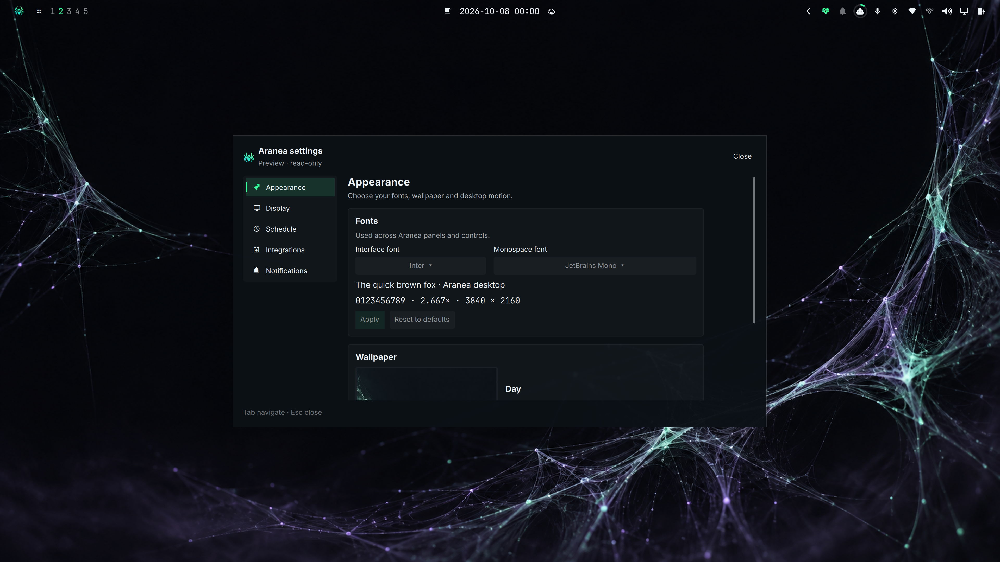
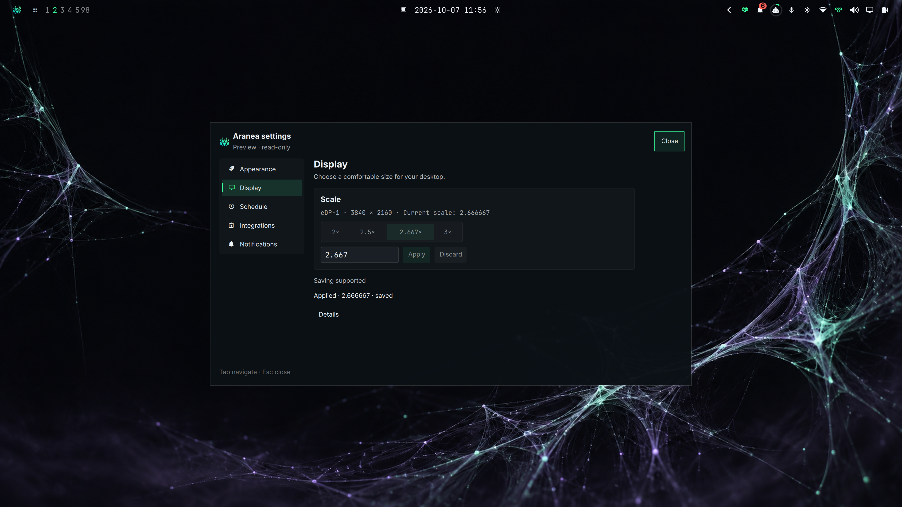

<div align="center">

# Aranea Desktop

**A quiet, obsidian Omarchy desktop experience with a living network of light.**

Deep black surfaces, mint activity, violet focus, atmospheric wallpapers, and
the AraneaDev mark carried consistently from boot to desktop.

[](https://github.com/AraneaDev/aranea-desktop/releases)
[](https://github.com/AraneaDev/aranea-desktop/actions/workflows/ci.yml)
[](https://github.com/AraneaDev/aranea-desktop)
[](https://github.com/AraneaDev/aranea-desktop/commits/master)
[](https://www.conventionalcommits.org/)

[Omarchy](https://omarchy.org) · [AraneaDev](https://aranea-development.nl)

</div>


Static fallback: [desktop capture](screenshots/desktop.png) · [full showcase GIF](screenshots/hero-showcase.gif)

## Quick start

Aranea Desktop expects an [Omarchy](https://omarchy.org) installation with
`omarchy` on `PATH`. From this checkout, open the guided installer:

```bash
./installer
```

Choose **Install/update** and a profile. The same operation is available directly:

```bash
scripts/install.sh --profile full --yes
omarchy theme set aranea
```

| Profile   | Includes                                                               |
| --------- | ---------------------------------------------------------------------- |
| `minimal` | Core theme and GTK experience                                          |
| `full`    | Every supported application integration                                |
| `no_apps` | Theme, cursor, icons, wallpaper, and branding without app integrations |

The TUI also offers diagnosis/repair and removal. It requires
[`gum`](https://github.com/charmbracelet/gum) and `jq`; JSON CLI output requires
`jq`. Preview installation with `scripts/install.sh --dry-run --yes`.
To update, rerun the installer or the CLI command with your selected profile.
The saved profile lives in `~/.local/state/aranea/profile`.

Select a wallpaper and optionally apply the boot splash:

```bash
scripts/aranea-wallpaper list
scripts/aranea-wallpaper set day
omarchy plymouth set-by-theme aranea
```

See [Getting started](docs/getting-started.md) for the full installation,
activation, and update workflow.

## Desktop experience

Aranea installs as the `aranea` theme and brings a consistent visual system to
the shell, applications, lock screen, and boot: obsidian surfaces, mint activity,
violet focus, and a transparent interactive bar. Wallpapers stay mark-free;
the spider identity appears in menus, lock, boot, idle, and fastfetch surfaces.

- **Command center:** Files, Terminal, Setup, Favorites, Recent, and searchable apps.
- **Settings:** wallpaper, fonts, motion, display scale, schedule, integrations, and DND.
- **Project workspaces:** confirmed Git discovery, grouped worktrees, project search, and Open/Resume with saved tools.
- **System controls:** network, VPN, audio, Bluetooth, displays, power, tray, calendar, and weather.
- **Health and notifications:** resource graphs, processes, services, reboot and container status, plus a quiet notification center.
- **Pickers and prompts:** clipboard with secret masking, emoji, wallpapers, and consistent polkit authentication.
- **Application integrations:** cursor, icons, terminals, editors, browser, media, Qt, and session styling.

### Project workspaces

Open **Setup → Projects**, confirm a development folder, review repositories and
worktrees, then **Add selected**. Search with `project:` to Open or Resume saved
tools. Dedicated workspace is the default; Customize makes current workspace an
explicit preference. Partial launches report each role and offer targeted recovery.
Repository scripts are never run by discovery or ordinary Open. Removing a
registration preserves folders and applications.

See [Project configuration](docs/configuration.md) for supported tools,
folder relocation and workspace choices, and [the JSON interface](docs/agent-interface.md)
for automation. Inert showcase IDs are `projects-empty`, `projects-discovery`,
`projects-grouped`, `projects-partial`, `project-details`, `project-search` and
`project-launch-partial`; [development instructions](docs/development.md)
render them without user repositories or desktop operations.

### Local agent activity

Open **Agents → Tasks** for Claude Code and Codex task activity alongside Usage.
Reporting is opt-in: run `aranea agents adapter status claude` or
`aranea agents adapter status codex`, then copy the matching install command from
Tasks setup. Review provider hook trust and start a new native CLI session;
configured hooks alone do not prove observed activity. Register projects explicitly.

Needs input, Ready for review and Failed transitions receive quiet, coalesced
notifications respecting DND and quiet hours. Open task inspects current details;
resume remains an explicit action. Verification is independently reported, and
session focus reaches only a proven hosting terminal. Activity is local to this
machine. See [setup, CLI examples and limitations](plugins/araneadev.activity/README.md).

### Typography and settings

Open **Setup → Aranea settings**, or search for “settings”. Aranea uses
**Inter** for the interface and **JetBrains Mono** for technical text.
Appearance offers searchable font choices and preview samples, including
**IBM Plex Sans**, **Source Sans 3**, **Inter Display**, **Inter Variable**, and
**JetBrains Mono NL**. Apply saves a draft; resetting defaults also requires
Apply. Saved font choices are preserved, and icons keep their dedicated font.
These choices affect Aranea panels and controls; application and terminal fonts
keep their own settings. See [Bundled fonts](fonts/README.md).

Wallpaper selection requires Apply, and schedule drafts require Save. Custom
display scales from 1 to 4 apply to the focused display and show the observed
effective fraction. Quiet hours are read-only. See
[Configuration](docs/configuration.md) for settings, state, and integrations.

### Everyday controls

The wallpaper picker includes `day`, `night`, `dawn`, `sparse`, `dense`, `dusk`,
`monochrome`, and `ultrawide`. Aranea Pulse adds an opt-in four-phase schedule
and filament OSD:

```bash
scripts/aranea-wallpaper schedule configure 06:00 08:00 18:00 20:00
scripts/aranea-wallpaper schedule on
scripts/aranea-integrations status --json
```

Activate or roll back integrations individually with
`scripts/aranea-integrations activate <id> --yes` and
`scripts/aranea-integrations deactivate <id>`. Managed files are backed up in
the Aranea state directory before changes. For NetworkManager and app-based
VPN support, see the [VPN guide](plugins/araneadev.vpn/README.md).

`Ctrl+P` pins the app under the cursor in the command menu. Favorites and Recent
live in `~/.local/state/aranea/menu.json`. Notifications collect in the center
(up to 100 items for 7 days); critical notifications stay until dismissed. Clipboard
secrets are masked and expire according to `ARANEA_CLIPBOARD_SECRET_TTL_MS`.
Health treats container exit codes 137 or 143 as a memory-kill signal only when
the container was stopped for that reason.

If you manually disable the polkit prompt with
`omarchy plugin disable araneadev.polkit`, run `omarchy restart shell` so
Omarchy's fallback prompt can take over.

## Gallery

The hero shows a tour of the desktop. The captures below cover each showcase
surface once, including compact Settings windows within the full desktop.

### Desktop and settings

| Desktop                             | Appearance                                       | Display scaling                                               |
| ----------------------------------- | ------------------------------------------------ | ------------------------------------------------------------- |
|  |  |  |

### Command center

| Menu                                  | System submenu                                  | Search                                      |
| ------------------------------------- | ----------------------------------------------- | ------------------------------------------- |
|  |  |  |

| Input                                     | Apps                          | Favorites and Recent                                                         |
| ----------------------------------------- | ----------------------------- | ---------------------------------------------------------------------------- |
|  |  | <br> |

### Health, notifications, and session

| Health                                   | Notifications                                   | Empty center                                                      |
| ---------------------------------------- | ----------------------------------------------- | ----------------------------------------------------------------- |
|  |  |  |

| Updates                                   | Workspaces                                        | Power                                    |
| ----------------------------------------- | ------------------------------------------------- | ---------------------------------------- |
|  |  |  |

| Authentication                                   | Lock screen                          | Boot splash                                       |
| ------------------------------------------------ | ------------------------------------ | ------------------------------------------------- |
|  |  |  |

### Bar controls

| Network                                      | VPN                                  | Bluetooth                                        |
| -------------------------------------------- | ------------------------------------ | ------------------------------------------------ |
|  |  |  |

| Audio                                    | Agents                                  | Displays                                     |
| ---------------------------------------- | --------------------------------------- | -------------------------------------------- |
|  |  |  |

| Tray menu                          | Tray management                                 | Filament OSD                         |
| ---------------------------------- | ----------------------------------------------- | ------------------------------------ |
|  |  |  |

| Calendar                           | Weather                             |
| ---------------------------------- | ----------------------------------- |
|  |  |

### Pickers and applications

| Clipboard                                      | Emoji                                   | Wallpaper picker                                  |
| ---------------------------------------------- | --------------------------------------- | ------------------------------------------------- |
|  |  |  |

| File manager                                  | Neovim                            | Btop                          |
| --------------------------------------------- | --------------------------------- | ----------------------------- |
|  |  |  |

### Wallpapers

| Day                                              | Night                                                | Dawn desktop                          |
| ------------------------------------------------ | ---------------------------------------------------- | ------------------------------------- |
|  |  |  |

| Sparse                                               | Dense                                              | Dusk                                             |
| ---------------------------------------------------- | -------------------------------------------------- | ------------------------------------------------ |
|  |  |  |

| Monochrome                                                   | Ultrawide                                                  |
| ------------------------------------------------------------ | ---------------------------------------------------------- |
|  |  |

See [Visual language](docs/visual-language.md) for the design system behind
these surfaces.

## Documentation and support

Start at the [documentation hub](docs/README.md), or choose a guide:

| Task                                 | Guide                                                                     |
| ------------------------------------ | ------------------------------------------------------------------------- |
| Install, update, activate, or remove | [Getting started](docs/getting-started.md)                                |
| Explore capabilities                 | [Features](docs/features.md)                                              |
| Configure settings and integrations  | [Configuration](docs/configuration.md)                                    |
| Diagnose and recover                 | [Troubleshooting](docs/troubleshooting.md)                                |
| Automate installation                | [Agent interface](docs/agent-interface.md)                                |
| Customize identity and artwork       | [Rebranding](docs/rebranding.md)                                          |
| Browse icons and typography          | [Icon gallery](docs/icons.md) · [Bundled fonts](fonts/README.md)          |
| Understand or contribute to the code | [Architecture](docs/architecture.md) · [Development](docs/development.md) |

For a problem, run `scripts/aranea-doctor`; `scripts/aranea-doctor --fix`
repairs stale hooks and plugin deployment. Include `scripts/aranea-about`,
`scripts/aranea-doctor --json`, your install profile, and whether a shell
restart changes the behavior in a [bug report](https://github.com/AraneaDev/aranea-desktop/issues).

## Helpers and automation

Run helpers from `scripts/` in a checkout, or from
`~/.config/omarchy/themes/aranea/scripts/<name>` after installation.

| Helper                                               | Purpose                                                 |
| ---------------------------------------------------- | ------------------------------------------------------- |
| `scripts/install.sh` / `scripts/uninstall.sh`        | Install, update, or remove Aranea                       |
| `scripts/aranea-doctor` / `scripts/aranea-about`     | Diagnose, repair, and summarize the installation        |
| `scripts/aranea-integrations`                        | Inspect and toggle integrations                         |
| `scripts/aranea-wallpaper` / `scripts/aranea-motion` | Select and schedule wallpapers; control animations      |
| `scripts/aranea-settings`                            | Read versioned settings JSON or invoke existing helpers |
| `scripts/install-fonts`                              | Install bundled fonts and refresh the font cache        |
| `scripts/aranea-showcase`                            | List documented surfaces                                |

The CLI is human-readable by default. Explicit `--json` emits versioned JSONL
events with stable step IDs; the process exit code remains authoritative:

```bash
scripts/install.sh --json --yes --profile minimal
scripts/uninstall.sh --json --yes --scope integration
scripts/aranea-doctor --json
```

See [Agent interface](docs/agent-interface.md) for the complete contract.

## Removal

Keep the theme directory while removing Aranea's integration:

```bash
scripts/uninstall.sh --scope integration --yes
```

Remove the integration and installed theme directory:

```bash
scripts/uninstall.sh --scope complete --replacement-theme Omarchy --yes
```

Use `--dry-run` to preview either operation. Bundled fonts remain installed
for documents and applications that selected them.

## Development

Run the repository quality gates and refresh the complete showcase with:

```bash
tools/check
scripts/capture-screenshots --all --output screenshots
```

See [Development](docs/development.md) for the repository map, focused tests,
design token generation, capture fixtures, and upstream tracking, and
[Contributing](CONTRIBUTING.md) for contribution and release conventions.

## License

Code is released under the [MIT License](LICENSE). Bundled fonts use the
[SIL Open Font License 1.1](fonts/README.md), with license texts in each family
directory. Check upstream project and asset licenses before redistributing
modified branding or artwork.
