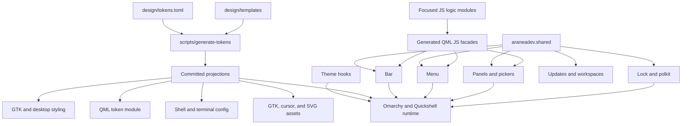
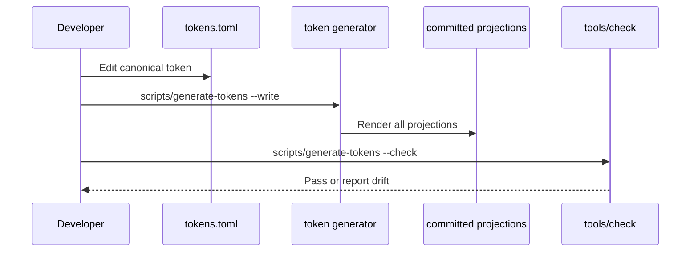
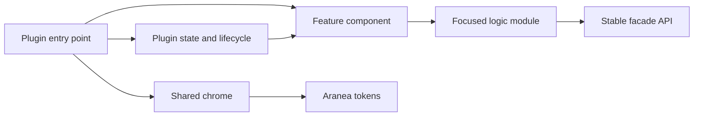
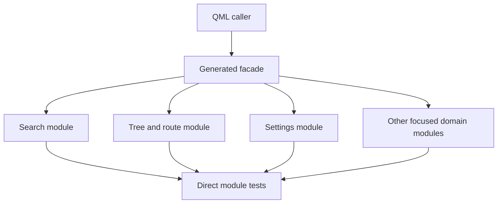
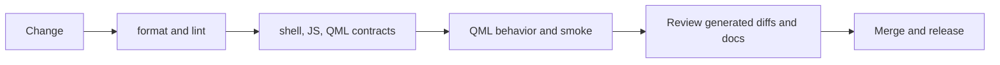

# Architecture

Aranea is a theme, shell extension, integration bundle, and set of safe
installation tools. The repository keeps those concerns separate so visual
changes can be made centrally without coupling runtime behavior to generated
assets or host state.

## System shape



The arrows describe ownership and data flow, not import syntax. The important
boundaries are:

| Layer                | Owns                                                        | Must not own                                               |
| -------------------- | ----------------------------------------------------------- | ---------------------------------------------------------- |
| Tokens and templates | Palette, spacing, typography, motion, and asset projections | Plugin state or host detection                             |
| Shared QML           | Reusable visual and input contracts                         | Plugin lifecycle, IPC, cursor state, or process management |
| Plugin entry points  | Composition, lifecycle, and plugin-specific interaction     | Duplicated global chrome or token literals                 |
| Focused JS modules   | Pure domain logic and normalization                         | QML window lifecycle or generated facade structure         |
| Generated facades    | Stable compatibility exports for QML                        | Hand-edited business logic                                 |
| Hooks and scripts    | Installation, activation, repair, and host integration      | Presentation decisions that belong in QML or templates     |

## Token flow

`design/tokens.toml` is the source of truth. Templates describe the target
format, and the generator renders committed files for each consumer. A change
to a color, dimension, or motion value should start in the token source or its
template, not in a generated CSS, TOML, QML, SVG, or cursor file.



Generated files are useful review artifacts and runtime inputs, but they are
not an editing boundary. The same rule applies to JS facades generated by
`tools/js-facade-generator.mjs`.

## Runtime composition

Plugin entry points should remain composition roots. Shared components remove
repeated contracts while leaving ownership with the plugin that understands
the behavior.



Current shared examples include `BrandHeader`, `StatusRow`,
`KeyboardInputFrame`, `KeyboardPanelFrame`, `RuntimePaths`, `SurfaceCard`,
`PanelHeader`, `StatusRail`, and `StatusTextPair`.

Extract a component when the contract is repeated, stable, and presentational.
Keep it local when it depends on plugin state, a particular service, a cursor,
or a one-off interaction. Prefer explicit properties and signals over reaching
through root IDs.

## Logic and facade decomposition

Large QML-compatible JavaScript facades preserve the public function names
used by QML. Focused modules own the implementation and tests.



When decomposing logic:

1. Preserve the facade's exported names and QML-compatible syntax.
2. Move one pure domain at a time into a sibling module.
3. Add direct tests for the new module before removing duplicate logic.
4. Regenerate the facade and run `node tools/js-facade-generator.mjs --check`.

## Validation boundaries



Use the narrowest useful check while iterating, then finish with the complete
repository gate:

```bash
scripts/generate-tokens --check
node tools/js-facade-generator.mjs --check
tests/qml-types.test.sh
tests/qml-behaviour.test.sh shared updates-widget workspaces-widget overlay-components polkit-components
tools/check
```

`tools/check --fast` is useful for local iteration. The full command is the
release gate because it includes slow contract tests and runtime smoke checks
when the host provides the required Omarchy and Quickshell dependencies.

## Further reading

- [Development](development.md) for repository conventions and extraction
  boundaries.
- [Agent development guide](agent-development.md) for safe automated changes.
- [Agent interface](agent-interface.md) for the installer and repair JSONL
  protocol.
- [Visual language](visual-language.md) for user-facing design principles.
