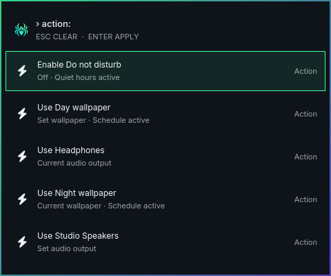

# Features

Aranea is designed as a system-wide visual language rather than a single bar
theme. The same identity appears in the shell, notifications, secure prompts,
wallpapers, cursors, icons, and application integrations.

## Command center

The bar opens an Omarchy command menu with Aranea identity, Files, Terminal,
and Setup tiles. Apps keeps Favorites and Recent state in
`~/.local/state/aranea/menu.json`. The menu uses a compact network-and-node
motif and supports keyboard navigation and pinned applications. Typing at the
root searches apps, menu commands, windows, workspaces, projects, settings and quick actions.
Use `app:`, `command:`, `window:`, `workspace:`, `setting:`, `project:` or `action:` to restrict results.
Submenu searches stay scoped; Search everywhere or Ctrl+F keeps the query while
returning to root. Enter uses the selected current target, and a disappearing
window clears that selection. The list caps at 50 matches with a refinement hint.
Dmenu choices and input answers keep their existing behavior.

Quick actions toggle manual Do not disturb, select an available audio output, or
apply an installed wallpaper while keeping the menu open. Current choices, quiet
hours and active schedules are labelled; those schedules remain in place. Pending
changes wait for confirmation. Failed actions can be retried with Enter; Tab
reaches the offered audio controls or Appearance recovery destination. Missing
capabilities are omitted.




## Notifications and health

Notifications go to the center instead of interrupting the desktop. Critical
items remain visible through a red indicator, while ordinary waiting items use
the mint badge. The health surface reports failed services, disk pressure,
reboot state, containers, CPU, memory, network, and process activity.


## Clipboard and emoji

The clipboard picker labels links, paths, colors, code, images, and text. It
keeps pinned entries above recent history and masks likely secrets. The emoji
picker keeps recent emoji close and supports insert versus copy actions.


## Secure prompts

The Aranea polkit surface gives privileged actions a consistent card with the
request, account, action details, and authentication state.


## Wallpapers and motion

The collection includes day, night, dawn, sparse, dense, dusk, monochrome, and
ultrawide variants. Wallpaper selection is stable by manifest ID, and the
optional schedule can move through four phases. Motion can be enabled or
disabled independently.

```bash
scripts/aranea-wallpaper list
scripts/aranea-wallpaper set dusk
scripts/aranea-wallpaper schedule configure 06:00 08:00 18:00 20:00
scripts/aranea-wallpaper schedule on
scripts/aranea-motion status
```

## Integrations

The theme includes cursor, icon, terminal, browser, media, Qt, session,
developer, and application integrations. They are managed with backups and can
be inspected or toggled individually:

```bash
scripts/aranea-integrations status --json
scripts/aranea-integrations activate <id> --yes
scripts/aranea-integrations deactivate <id> --yes
```

## More surfaces

The repository also contains lock, Plymouth, Cava, cursor, icon, GTK, browser,
terminal, and media styling. The README contains the visual showcase; this
page explains what each surface is for.

## Desktop settings

Setup opens a compact, centered Settings window with Appearance, Display,
Schedule, Projects, Integrations and Notifications destinations. Appearance offers
searchable interface/monospace font choices with samples and explicit Apply;
icons keep their dedicated family. Appearance keeps its
wallpaper chooser collapsed until requested. Wallpaper selection and Display
presets edit local drafts, with explicit Apply and Discard. Display accepts
exact decimal scales and reports effective scale and persistence separately.
Drafts and scroll positions survive page navigation; long content scrolls
inside the window. Motion, integration and Do not disturb toggles keep their
immediate behavior.

## Project workspaces

**Setup → Projects** starts with **Choose folder**, or an absolute folder path.
Confirm the folder, review the discovered Git repositories and worktrees, select
checkouts, then **Add selected**. Discovery alone registers nothing. Related
worktrees share a project; each checkout retains its exact path and branch.
**Review ignored repositories** lets you restore a group for the next refresh.
Scanning runs only after a confirmed folder or explicit Refresh. A partial scan
keeps its results and explains how to choose a narrower folder.

Search project names, paths and branches with `project:`. **Open** uses saved
preferences and a dedicated workspace by default. **Resume** focuses freshly
verified project windows and opens missing tools when safe. **Customize** offers
an editor, terminal and an explicit current-workspace preference. Opening a
worktree separately preserves its separate workspace association. Occupied
workspaces and other checkouts' observed windows are preserved.

Project details show launch outcomes and role recovery. Retry targets a reported failed
role; an unconfirmed launch offers an explicit new window instead of an automatic
retry. A ten-second deadline can leave a partial result even when the application
started. Workspace titles, application classes and workspace membership alone
never establish ownership. The workspace overview shows project context only
when the current owner can justify it. A shell restart loses live bindings;
applications and repository files remain intact.

## Project commands and previews

Select a registered project and exact checkout in **Setup → Projects**, then use
**Actions** to add a named command or service. The form has a name, executable,
individual argument rows with Add/Remove controls, working folder (default `.`),
a command timeout and an optional service preview URL. Save and Cancel never run
the command. Definitions stay in local Aranea state; repository files are not
imported as executable configuration. Review the displayed command and folder,
then explicitly Run or Start. Opening/discovering a project, theme reload and
shell startup never execute saved actions.

Runs retain their accepted command and exact checkout. Refresh reads current
status; View logs loads selectable plaintext from the local journal. Stop cancels
only the proven owned run and its process group. Restart waits for confirmed
cleanup. If the command changed since that run, review the current action and use
Run/Start; the UI refuses an outdated restart. Conflicting edits keep the draft:
Refresh, review the latest saved definition, then explicitly Save draft over latest.

A command's exit status, service process state and preview reachability are shown
separately. Command success does not verify an agent task or the whole project.
A reachable URL does not prove which service owns its port. Open preview is an
explicit browser request for a currently owned running service. Focus project
reuses the existing workspace controls without launching an action.

The systemd user manager owns runs independently of the panel. Closing Settings,
reloading the shell, changing themes or closing the CLI observer does not cancel
them; reopen and Refresh the retained run. Services have no automatic restart or
login startup and do not promise to survive logout or reboot. A missing manager
makes execution unavailable while definitions remain editable. Uncertain starts
or cleanup stay protected until exact evidence is recovered. Logs follow system
journal retention, with at most 200 entries / 256 KiB displayed per read.

The same actions are available through the [public CLI](agent-interface.md#configured-project-actions-and-retained-runs).
Native manager/browser execution is separate from the sandboxed automated tests;
those tests do not run configured repository commands on the live desktop.
