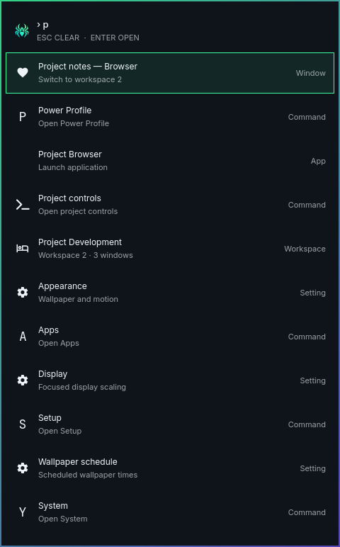

# Features

Aranea is designed as a system-wide visual language rather than a single bar
theme. The same identity appears in the shell, notifications, secure prompts,
wallpapers, cursors, icons, and application integrations.

## Command center

The bar opens an Omarchy command menu with Aranea identity, Files, Terminal,
and Setup tiles. Apps keeps Favorites and Recent state in
`~/.local/state/aranea/menu.json`. The menu uses a compact network-and-node
motif and supports keyboard navigation and pinned applications. Typing at the
root searches apps, menu commands, windows, workspaces and settings sections.
Use `app:`, `command:`, `window:`, `workspace:` or `setting:` to restrict results.
Submenu searches stay scoped; Search everywhere or Ctrl+F keeps the query while
returning to root. Enter uses the selected current target, and a disappearing
window clears that selection. The list caps at 50 matches with a refinement hint.
Dmenu choices and input answers keep their existing behavior.




## Notifications and health

Notifications go to the center instead of interrupting the desktop. Critical
items remain visible through a red indicator, while ordinary waiting items use
the mint badge. The health surface reports failed services, disk pressure,
reboot state, containers, CPU, memory, network, and process activity.


## Clipboard and emoji

The clipboard picker labels links, paths, colors, code, images, and text. It
keeps pinned entries above recent history and masks likely secrets. The emoji
picker keeps recent emoji close and supports insert versus copy actions.


## Secure prompts

The Aranea polkit surface gives privileged actions a consistent card with the
request, account, action details, and authentication state.


## Wallpapers and motion

The collection includes day, night, dawn, sparse, dense, dusk, monochrome, and
ultrawide variants. Wallpaper selection is stable by manifest ID, and the
optional schedule can move through four phases. Motion can be enabled or
disabled independently.

```bash
scripts/aranea-wallpaper list
scripts/aranea-wallpaper set dusk
scripts/aranea-wallpaper schedule configure 06:00 08:00 18:00 20:00
scripts/aranea-wallpaper schedule on
scripts/aranea-motion status
```

## Integrations

The theme includes cursor, icon, terminal, browser, media, Qt, session,
developer, and application integrations. They are managed with backups and can
be inspected or toggled individually:

```bash
scripts/aranea-integrations status --json
scripts/aranea-integrations activate <id> --yes
scripts/aranea-integrations deactivate <id> --yes
```

## More surfaces

The repository also contains lock, Plymouth, Cava, cursor, icon, GTK, browser,
terminal, and media styling. The README contains the visual showcase; this
page explains what each surface is for.

## Desktop settings

Setup opens a compact, centered Settings window with Appearance, Display,
Schedule, Integrations and Notifications destinations. Appearance keeps its
wallpaper chooser collapsed until requested. Wallpaper selection and Display
presets edit local drafts, with explicit Apply and Discard. Display accepts
exact decimal scales and reports effective scale and persistence separately.
Drafts and scroll positions survive page navigation; long content scrolls
inside the window. Motion, integration and Do not disturb toggles keep their
immediate behavior.
