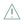
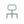
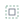
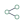
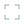
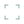
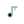

# Aranea Icon Gallery

Every standalone Aranea SVG is shown below at a glance. Click an icon name to open its source artwork.

### Places

| Icon | Preview |
| --- | --- |
| [`folder-documents`](../integrations/icons/aranea/scalable/places/folder-documents.svg) |  |
| [`folder-download`](../integrations/icons/aranea/scalable/places/folder-download.svg) |  |
| [`folder-music`](../integrations/icons/aranea/scalable/places/folder-music.svg) |  |
| [`folder-new`](../integrations/icons/aranea/scalable/places/folder-new.svg) |  |
| [`folder-open`](../integrations/icons/aranea/scalable/places/folder-open.svg) |  |
| [`folder-pictures`](../integrations/icons/aranea/scalable/places/folder-pictures.svg) |  |
| [`folder-publicshare`](../integrations/icons/aranea/scalable/places/folder-publicshare.svg) |  |
| [`folder-remote`](../integrations/icons/aranea/scalable/places/folder-remote.svg) |  |
| [`folder-root`](../integrations/icons/aranea/scalable/places/folder-root.svg) |  |
| [`folder-templates`](../integrations/icons/aranea/scalable/places/folder-templates.svg) |  |
| [`folder-videos`](../integrations/icons/aranea/scalable/places/folder-videos.svg) |  |
| [`folder-visiting`](../integrations/icons/aranea/scalable/places/folder-visiting.svg) |  |
| [`folder`](../integrations/icons/aranea/scalable/places/folder.svg) |  |
| [`go-home`](../integrations/icons/aranea/scalable/places/go-home.svg) |  |
| [`user-home`](../integrations/icons/aranea/scalable/places/user-home.svg) |  |
| [`user-trash-full`](../integrations/icons/aranea/scalable/places/user-trash-full.svg) |  |
| [`user-trash`](../integrations/icons/aranea/scalable/places/user-trash.svg) |  |

### Devices

| Icon | Preview |
| --- | --- |
| [`computer-desktop`](../integrations/icons/aranea/scalable/devices/computer-desktop.svg) |  |
| [`computer-laptop`](../integrations/icons/aranea/scalable/devices/computer-laptop.svg) |  |
| [`computer`](../integrations/icons/aranea/scalable/devices/computer.svg) |  |
| [`drive-harddisk-system`](../integrations/icons/aranea/scalable/devices/drive-harddisk-system.svg) |  |
| [`drive-harddisk`](../integrations/icons/aranea/scalable/devices/drive-harddisk.svg) |  |
| [`drive-multidisk`](../integrations/icons/aranea/scalable/devices/drive-multidisk.svg) |  |
| [`drive-nvme`](../integrations/icons/aranea/scalable/devices/drive-nvme.svg) |  |
| [`drive-optical`](../integrations/icons/aranea/scalable/devices/drive-optical.svg) |  |
| [`drive-removable-media`](../integrations/icons/aranea/scalable/devices/drive-removable-media.svg) |  |
| [`media-flash`](../integrations/icons/aranea/scalable/devices/media-flash.svg) |  |
| [`media-memory`](../integrations/icons/aranea/scalable/devices/media-memory.svg) |  |
| [`media-sd`](../integrations/icons/aranea/scalable/devices/media-sd.svg) |  |
| [`network-server`](../integrations/icons/aranea/scalable/devices/network-server.svg) |  |
| [`network-wireless`](../integrations/icons/aranea/scalable/devices/network-wireless.svg) |  |
| [`network-workgroup`](../integrations/icons/aranea/scalable/devices/network-workgroup.svg) |  |

### Status

| Icon | Preview |
| --- | --- |
| [`audio-input-microphone-muted`](../integrations/icons/aranea/scalable/status/audio-input-microphone-muted.svg) |  |
| [`audio-input-microphone`](../integrations/icons/aranea/scalable/status/audio-input-microphone.svg) |  |
| [`audio-volume-high`](../integrations/icons/aranea/scalable/status/audio-volume-high.svg) |  |
| [`audio-volume-low`](../integrations/icons/aranea/scalable/status/audio-volume-low.svg) |  |
| [`audio-volume-medium`](../integrations/icons/aranea/scalable/status/audio-volume-medium.svg) |  |
| [`audio-volume-muted`](../integrations/icons/aranea/scalable/status/audio-volume-muted.svg) |  |
| [`battery-caution`](../integrations/icons/aranea/scalable/status/battery-caution.svg) |  |
| [`battery-charging`](../integrations/icons/aranea/scalable/status/battery-charging.svg) |  |
| [`battery-full`](../integrations/icons/aranea/scalable/status/battery-full.svg) |  |
| [`battery-low`](../integrations/icons/aranea/scalable/status/battery-low.svg) |  |
| [`battery-medium`](../integrations/icons/aranea/scalable/status/battery-medium.svg) |  |
| [`battery-missing`](../integrations/icons/aranea/scalable/status/battery-missing.svg) |  |
| [`battery`](../integrations/icons/aranea/scalable/status/battery.svg) |  |
| [`bluetooth-active`](../integrations/icons/aranea/scalable/status/bluetooth-active.svg) |  |
| [`bluetooth-disabled`](../integrations/icons/aranea/scalable/status/bluetooth-disabled.svg) |  |
| [`bluetooth`](../integrations/icons/aranea/scalable/status/bluetooth.svg) |  |
| [`changes-prevent`](../integrations/icons/aranea/scalable/status/changes-prevent.svg) |  |
| [`cloud-download`](../integrations/icons/aranea/scalable/status/cloud-download.svg) |  |
| [`cloud-upload`](../integrations/icons/aranea/scalable/status/cloud-upload.svg) |  |
| [`cloud`](../integrations/icons/aranea/scalable/status/cloud.svg) |  |
| [`dialog-error`](../integrations/icons/aranea/scalable/status/dialog-error.svg) |  |
| [`dialog-information`](../integrations/icons/aranea/scalable/status/dialog-information.svg) |  |
| [`dialog-password`](../integrations/icons/aranea/scalable/status/dialog-password.svg) |  |
| [`dialog-question`](../integrations/icons/aranea/scalable/status/dialog-question.svg) |  |
| [`dialog-warning`](../integrations/icons/aranea/scalable/status/dialog-warning.svg) |  |
| [`display-brightness-symbolic`](../integrations/icons/aranea/scalable/status/display-brightness-symbolic.svg) |  |
| [`display-brightness`](../integrations/icons/aranea/scalable/status/display-brightness.svg) |  |
| [`emblem-danger`](../integrations/icons/aranea/scalable/status/emblem-danger.svg) |  |
| [`emblem-error`](../integrations/icons/aranea/scalable/status/emblem-error.svg) |  |
| [`emblem-favorite`](../integrations/icons/aranea/scalable/status/emblem-favorite.svg) |  |
| [`emblem-important`](../integrations/icons/aranea/scalable/status/emblem-important.svg) |  |
| [`emblem-mounted`](../integrations/icons/aranea/scalable/status/emblem-mounted.svg) |  |
| [`emblem-ok`](../integrations/icons/aranea/scalable/status/emblem-ok.svg) |  |
| [`emblem-readonly`](../integrations/icons/aranea/scalable/status/emblem-readonly.svg) |  |
| [`emblem-shared`](../integrations/icons/aranea/scalable/status/emblem-shared.svg) |  |
| [`emblem-symbolic-link`](../integrations/icons/aranea/scalable/status/emblem-symbolic-link.svg) |  |
| [`emblem-synchronized`](../integrations/icons/aranea/scalable/status/emblem-synchronized.svg) |  |
| [`emblem-unreadable`](../integrations/icons/aranea/scalable/status/emblem-unreadable.svg) |  |
| [`emblem-warning`](../integrations/icons/aranea/scalable/status/emblem-warning.svg) |  |
| [`folder-sync`](../integrations/icons/aranea/scalable/status/folder-sync.svg) |  |
| [`input-gaming`](../integrations/icons/aranea/scalable/status/input-gaming.svg) |  |
| [`input-keyboard`](../integrations/icons/aranea/scalable/status/input-keyboard.svg) |  |
| [`input-mouse`](../integrations/icons/aranea/scalable/status/input-mouse.svg) |  |
| [`input-tablet`](../integrations/icons/aranea/scalable/status/input-tablet.svg) |  |
| [`input-touchpad`](../integrations/icons/aranea/scalable/status/input-touchpad.svg) |  |
| [`network-error`](../integrations/icons/aranea/scalable/status/network-error.svg) |  |
| [`network-vpn`](../integrations/icons/aranea/scalable/status/network-vpn.svg) |  |
| [`network-wired`](../integrations/icons/aranea/scalable/status/network-wired.svg) |  |
| [`network-wireless`](../integrations/icons/aranea/scalable/status/network-wireless.svg) |  |
| [`notification`](../integrations/icons/aranea/scalable/status/notification.svg) |  |
| [`object-locked`](../integrations/icons/aranea/scalable/status/object-locked.svg) |  |
| [`object-unlocked`](../integrations/icons/aranea/scalable/status/object-unlocked.svg) |  |
| [`process-completed`](../integrations/icons/aranea/scalable/status/process-completed.svg) |  |
| [`process-error`](../integrations/icons/aranea/scalable/status/process-error.svg) |  |
| [`process-stop`](../integrations/icons/aranea/scalable/status/process-stop.svg) |  |
| [`process-working`](../integrations/icons/aranea/scalable/status/process-working.svg) |  |
| [`security-high`](../integrations/icons/aranea/scalable/status/security-high.svg) |  |
| [`security-low`](../integrations/icons/aranea/scalable/status/security-low.svg) |  |
| [`security-medium`](../integrations/icons/aranea/scalable/status/security-medium.svg) |  |
| [`sync-error`](../integrations/icons/aranea/scalable/status/sync-error.svg) |  |
| [`system-lock-screen`](../integrations/icons/aranea/scalable/status/system-lock-screen.svg) |  |
| [`video-display`](../integrations/icons/aranea/scalable/status/video-display.svg) |  |
| [`video-projector`](../integrations/icons/aranea/scalable/status/video-projector.svg) |  |

### Actions

| Icon | Preview |
| --- | --- |
| [`application-exit`](../integrations/icons/aranea/scalable/actions/application-exit.svg) |  |
| [`debug-run`](../integrations/icons/aranea/scalable/actions/debug-run.svg) |  |
| [`debug-step`](../integrations/icons/aranea/scalable/actions/debug-step.svg) |  |
| [`document-new`](../integrations/icons/aranea/scalable/actions/document-new.svg) |  |
| [`document-open`](../integrations/icons/aranea/scalable/actions/document-open.svg) |  |
| [`document-print`](../integrations/icons/aranea/scalable/actions/document-print.svg) |  |
| [`document-revert`](../integrations/icons/aranea/scalable/actions/document-revert.svg) |  |
| [`document-save-as`](../integrations/icons/aranea/scalable/actions/document-save-as.svg) |  |
| [`document-save`](../integrations/icons/aranea/scalable/actions/document-save.svg) |  |
| [`document-send`](../integrations/icons/aranea/scalable/actions/document-send.svg) |  |
| [`edit-copy`](../integrations/icons/aranea/scalable/actions/edit-copy.svg) |  |
| [`edit-cut`](../integrations/icons/aranea/scalable/actions/edit-cut.svg) |  |
| [`edit-delete`](../integrations/icons/aranea/scalable/actions/edit-delete.svg) |  |
| [`edit-find`](../integrations/icons/aranea/scalable/actions/edit-find.svg) |  |
| [`edit-paste`](../integrations/icons/aranea/scalable/actions/edit-paste.svg) |  |
| [`edit-redo`](../integrations/icons/aranea/scalable/actions/edit-redo.svg) |  |
| [`edit-select-all`](../integrations/icons/aranea/scalable/actions/edit-select-all.svg) |  |
| [`edit-undo`](../integrations/icons/aranea/scalable/actions/edit-undo.svg) |  |
| [`go-next`](../integrations/icons/aranea/scalable/actions/go-next.svg) |  |
| [`go-previous`](../integrations/icons/aranea/scalable/actions/go-previous.svg) |  |
| [`go-up`](../integrations/icons/aranea/scalable/actions/go-up.svg) |  |
| [`insert-link`](../integrations/icons/aranea/scalable/actions/insert-link.svg) |  |
| [`mail-send`](../integrations/icons/aranea/scalable/actions/mail-send.svg) |  |
| [`media-eject`](../integrations/icons/aranea/scalable/actions/media-eject.svg) |  |
| [`media-playback-pause`](../integrations/icons/aranea/scalable/actions/media-playback-pause.svg) |  |
| [`media-playback-start`](../integrations/icons/aranea/scalable/actions/media-playback-start.svg) |  |
| [`media-playback-stop`](../integrations/icons/aranea/scalable/actions/media-playback-stop.svg) |  |
| [`media-record`](../integrations/icons/aranea/scalable/actions/media-record.svg) |  |
| [`media-skip-backward`](../integrations/icons/aranea/scalable/actions/media-skip-backward.svg) |  |
| [`media-skip-forward`](../integrations/icons/aranea/scalable/actions/media-skip-forward.svg) |  |
| [`network-receive`](../integrations/icons/aranea/scalable/actions/network-receive.svg) |  |
| [`network-transmit`](../integrations/icons/aranea/scalable/actions/network-transmit.svg) |  |
| [`package-x-generic`](../integrations/icons/aranea/scalable/actions/package-x-generic.svg) |  |
| [`share`](../integrations/icons/aranea/scalable/actions/share.svg) |  |
| [`software-update-available`](../integrations/icons/aranea/scalable/actions/software-update-available.svg) |  |
| [`system-hibernate`](../integrations/icons/aranea/scalable/actions/system-hibernate.svg) |  |
| [`system-log-out`](../integrations/icons/aranea/scalable/actions/system-log-out.svg) |  |
| [`system-reboot`](../integrations/icons/aranea/scalable/actions/system-reboot.svg) |  |
| [`system-search`](../integrations/icons/aranea/scalable/actions/system-search.svg) |  |
| [`system-shutdown`](../integrations/icons/aranea/scalable/actions/system-shutdown.svg) |  |
| [`system-sleep`](../integrations/icons/aranea/scalable/actions/system-sleep.svg) |  |
| [`system-software-install`](../integrations/icons/aranea/scalable/actions/system-software-install.svg) |  |
| [`system-software-uninstall`](../integrations/icons/aranea/scalable/actions/system-software-uninstall.svg) |  |
| [`system-software-update`](../integrations/icons/aranea/scalable/actions/system-software-update.svg) |  |
| [`system-suspend`](../integrations/icons/aranea/scalable/actions/system-suspend.svg) |  |
| [`view-column`](../integrations/icons/aranea/scalable/actions/view-column.svg) |  |
| [`view-fullscreen`](../integrations/icons/aranea/scalable/actions/view-fullscreen.svg) |  |
| [`view-grid`](../integrations/icons/aranea/scalable/actions/view-grid.svg) |  |
| [`view-hidden`](../integrations/icons/aranea/scalable/actions/view-hidden.svg) |  |
| [`view-list`](../integrations/icons/aranea/scalable/actions/view-list.svg) |  |
| [`view-refresh`](../integrations/icons/aranea/scalable/actions/view-refresh.svg) |  |
| [`view-restore`](../integrations/icons/aranea/scalable/actions/view-restore.svg) |  |
| [`view-sort-ascending`](../integrations/icons/aranea/scalable/actions/view-sort-ascending.svg) |  |
| [`view-sort-descending`](../integrations/icons/aranea/scalable/actions/view-sort-descending.svg) |  |
| [`window-close`](../integrations/icons/aranea/scalable/actions/window-close.svg) |  |
| [`window-maximize`](../integrations/icons/aranea/scalable/actions/window-maximize.svg) |  |
| [`window-minimize`](../integrations/icons/aranea/scalable/actions/window-minimize.svg) |  |
| [`window-restore`](../integrations/icons/aranea/scalable/actions/window-restore.svg) |  |

### Apps

| Icon | Preview |
| --- | --- |
| [`accessories-text-editor`](../integrations/icons/aranea/scalable/apps/accessories-text-editor.svg) |  |
| [`applications-development`](../integrations/icons/aranea/scalable/apps/applications-development.svg) |  |
| [`applications-graphics`](../integrations/icons/aranea/scalable/apps/applications-graphics.svg) |  |
| [`applications-multimedia`](../integrations/icons/aranea/scalable/apps/applications-multimedia.svg) |  |
| [`applications-system`](../integrations/icons/aranea/scalable/apps/applications-system.svg) |  |
| [`preferences-system`](../integrations/icons/aranea/scalable/apps/preferences-system.svg) |  |
| [`system-file-manager`](../integrations/icons/aranea/scalable/apps/system-file-manager.svg) |  |
| [`text-x-source`](../integrations/icons/aranea/scalable/apps/text-x-source.svg) |  |
| [`utilities-log-viewer`](../integrations/icons/aranea/scalable/apps/utilities-log-viewer.svg) |  |
| [`utilities-system-monitor`](../integrations/icons/aranea/scalable/apps/utilities-system-monitor.svg) |  |
| [`utilities-terminal`](../integrations/icons/aranea/scalable/apps/utilities-terminal.svg) |  |
| [`web-browser`](../integrations/icons/aranea/scalable/apps/web-browser.svg) |  |

### Mimetypes

| Icon | Preview |
| --- | --- |
| [`7z`](../integrations/icons/aranea/scalable/mimetypes/7z.svg) |  |
| [`application-gzip`](../integrations/icons/aranea/scalable/mimetypes/application-gzip.svg) |  |
| [`application-javascript`](../integrations/icons/aranea/scalable/mimetypes/application-javascript.svg) |  |
| [`application-json`](../integrations/icons/aranea/scalable/mimetypes/application-json.svg) |  |
| [`application-msword`](../integrations/icons/aranea/scalable/mimetypes/application-msword.svg) |  |
| [`application-octet-stream`](../integrations/icons/aranea/scalable/mimetypes/application-octet-stream.svg) |  |
| [`application-pdf`](../integrations/icons/aranea/scalable/mimetypes/application-pdf.svg) |  |
| [`application-vnd.ms-excel`](../integrations/icons/aranea/scalable/mimetypes/application-vnd.ms-excel.svg) |  |
| [`application-vnd.ms-powerpoint`](../integrations/icons/aranea/scalable/mimetypes/application-vnd.ms-powerpoint.svg) |  |
| [`application-vnd.oasis.opendocument.presentation`](../integrations/icons/aranea/scalable/mimetypes/application-vnd.oasis.opendocument.presentation.svg) |  |
| [`application-vnd.oasis.opendocument.spreadsheet`](../integrations/icons/aranea/scalable/mimetypes/application-vnd.oasis.opendocument.spreadsheet.svg) |  |
| [`application-vnd.oasis.opendocument.text`](../integrations/icons/aranea/scalable/mimetypes/application-vnd.oasis.opendocument.text.svg) |  |
| [`application-x-7z-compressed`](../integrations/icons/aranea/scalable/mimetypes/application-x-7z-compressed.svg) |  |
| [`application-x-cd-image`](../integrations/icons/aranea/scalable/mimetypes/application-x-cd-image.svg) |  |
| [`application-x-desktop`](../integrations/icons/aranea/scalable/mimetypes/application-x-desktop.svg) |  |
| [`application-x-executable`](../integrations/icons/aranea/scalable/mimetypes/application-x-executable.svg) |  |
| [`application-x-iso9660-appimage`](../integrations/icons/aranea/scalable/mimetypes/application-x-iso9660-appimage.svg) |  |
| [`application-x-sharedlib`](../integrations/icons/aranea/scalable/mimetypes/application-x-sharedlib.svg) |  |
| [`application-x-tar`](../integrations/icons/aranea/scalable/mimetypes/application-x-tar.svg) |  |
| [`application-xml`](../integrations/icons/aranea/scalable/mimetypes/application-xml.svg) |  |
| [`application-zip`](../integrations/icons/aranea/scalable/mimetypes/application-zip.svg) |  |
| [`audio-flac`](../integrations/icons/aranea/scalable/mimetypes/audio-flac.svg) |  |
| [`audio-ogg`](../integrations/icons/aranea/scalable/mimetypes/audio-ogg.svg) |  |
| [`audio-x-generic`](../integrations/icons/aranea/scalable/mimetypes/audio-x-generic.svg) |  |
| [`audio-x-mpeg`](../integrations/icons/aranea/scalable/mimetypes/audio-x-mpeg.svg) |  |
| [`audio-x-wav`](../integrations/icons/aranea/scalable/mimetypes/audio-x-wav.svg) |  |
| [`font-otf`](../integrations/icons/aranea/scalable/mimetypes/font-otf.svg) |  |
| [`font-ttf`](../integrations/icons/aranea/scalable/mimetypes/font-ttf.svg) |  |
| [`font-type1`](../integrations/icons/aranea/scalable/mimetypes/font-type1.svg) |  |
| [`font-x-generic`](../integrations/icons/aranea/scalable/mimetypes/font-x-generic.svg) |  |
| [`image-gif`](../integrations/icons/aranea/scalable/mimetypes/image-gif.svg) |  |
| [`image-jpeg`](../integrations/icons/aranea/scalable/mimetypes/image-jpeg.svg) |  |
| [`image-png`](../integrations/icons/aranea/scalable/mimetypes/image-png.svg) |  |
| [`image-svg+xml`](../integrations/icons/aranea/scalable/mimetypes/image-svg+xml.svg) |  |
| [`image-webp`](../integrations/icons/aranea/scalable/mimetypes/image-webp.svg) |  |
| [`image-x-generic`](../integrations/icons/aranea/scalable/mimetypes/image-x-generic.svg) |  |
| [`package-x-generic`](../integrations/icons/aranea/scalable/mimetypes/package-x-generic.svg) |  |
| [`package`](../integrations/icons/aranea/scalable/mimetypes/package.svg) |  |
| [`text-css`](../integrations/icons/aranea/scalable/mimetypes/text-css.svg) |  |
| [`text-html`](../integrations/icons/aranea/scalable/mimetypes/text-html.svg) |  |
| [`text-plain`](../integrations/icons/aranea/scalable/mimetypes/text-plain.svg) |  |
| [`text-richtext`](../integrations/icons/aranea/scalable/mimetypes/text-richtext.svg) |  |
| [`text-x-c++src`](../integrations/icons/aranea/scalable/mimetypes/text-x-c++src.svg) |  |
| [`text-x-c`](../integrations/icons/aranea/scalable/mimetypes/text-x-c.svg) |  |
| [`text-x-generic`](../integrations/icons/aranea/scalable/mimetypes/text-x-generic.svg) |  |
| [`text-x-java`](../integrations/icons/aranea/scalable/mimetypes/text-x-java.svg) |  |
| [`text-x-python`](../integrations/icons/aranea/scalable/mimetypes/text-x-python.svg) |  |
| [`text-x-rust`](../integrations/icons/aranea/scalable/mimetypes/text-x-rust.svg) |  |
| [`text-x-script`](../integrations/icons/aranea/scalable/mimetypes/text-x-script.svg) |  |
| [`video-mp4`](../integrations/icons/aranea/scalable/mimetypes/video-mp4.svg) |  |
| [`video-webm`](../integrations/icons/aranea/scalable/mimetypes/video-webm.svg) |  |
| [`video-x-generic`](../integrations/icons/aranea/scalable/mimetypes/video-x-generic.svg) |  |
| [`video-x-matroska`](../integrations/icons/aranea/scalable/mimetypes/video-x-matroska.svg) |  |
| [`x-office-document`](../integrations/icons/aranea/scalable/mimetypes/x-office-document.svg) |  |
