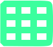
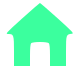

# Aranea Icon Gallery

The compact Aranea icon core uses the same solid, bright-green glyph language as the Command Center. Unsupported long-tail icons inherit from the host theme.

### Actions

| Icon | Preview |
| --- | --- |
| [`application-exit`](../integrations/icons/aranea/scalable/actions/application-exit.svg) |  |
| [`document-new`](../integrations/icons/aranea/scalable/actions/document-new.svg) |  |
| [`document-open`](../integrations/icons/aranea/scalable/actions/document-open.svg) |  |
| [`document-save`](../integrations/icons/aranea/scalable/actions/document-save.svg) |  |
| [`edit-copy`](../integrations/icons/aranea/scalable/actions/edit-copy.svg) |  |
| [`edit-cut`](../integrations/icons/aranea/scalable/actions/edit-cut.svg) |  |
| [`edit-delete`](../integrations/icons/aranea/scalable/actions/edit-delete.svg) |  |
| [`edit-find`](../integrations/icons/aranea/scalable/actions/edit-find.svg) |  |
| [`go-next`](../integrations/icons/aranea/scalable/actions/go-next.svg) |  |
| [`go-previous`](../integrations/icons/aranea/scalable/actions/go-previous.svg) |  |
| [`go-up`](../integrations/icons/aranea/scalable/actions/go-up.svg) |  |
| [`view-grid`](../integrations/icons/aranea/scalable/actions/view-grid.svg) |  |
| [`view-list`](../integrations/icons/aranea/scalable/actions/view-list.svg) |  |
| [`view-refresh`](../integrations/icons/aranea/scalable/actions/view-refresh.svg) |  |
### Apps

| Icon | Preview |
| --- | --- |
| [`accessories-text-editor`](../integrations/icons/aranea/scalable/apps/accessories-text-editor.svg) |  |
| [`preferences-system`](../integrations/icons/aranea/scalable/apps/preferences-system.svg) |  |
| [`system-file-manager`](../integrations/icons/aranea/scalable/apps/system-file-manager.svg) |  |
| [`utilities-terminal`](../integrations/icons/aranea/scalable/apps/utilities-terminal.svg) |  |
| [`web-browser`](../integrations/icons/aranea/scalable/apps/web-browser.svg) |  |
### Devices

| Icon | Preview |
| --- | --- |
| [`computer-desktop`](../integrations/icons/aranea/scalable/devices/computer-desktop.svg) |  |
| [`computer-laptop`](../integrations/icons/aranea/scalable/devices/computer-laptop.svg) |  |
| [`computer`](../integrations/icons/aranea/scalable/devices/computer.svg) |  |
| [`drive-harddisk-system`](../integrations/icons/aranea/scalable/devices/drive-harddisk-system.svg) |  |
| [`drive-harddisk`](../integrations/icons/aranea/scalable/devices/drive-harddisk.svg) |  |
| [`drive-optical`](../integrations/icons/aranea/scalable/devices/drive-optical.svg) |  |
| [`drive-removable-media`](../integrations/icons/aranea/scalable/devices/drive-removable-media.svg) |  |
| [`media-flash`](../integrations/icons/aranea/scalable/devices/media-flash.svg) |  |
| [`media-sd`](../integrations/icons/aranea/scalable/devices/media-sd.svg) |  |
| [`network-server`](../integrations/icons/aranea/scalable/devices/network-server.svg) |  |
| [`network-wireless`](../integrations/icons/aranea/scalable/devices/network-wireless.svg) |  |
### Mimetypes

| Icon | Preview |
| --- | --- |
| [`application-json`](../integrations/icons/aranea/scalable/mimetypes/application-json.svg) |  |
| [`application-pdf`](../integrations/icons/aranea/scalable/mimetypes/application-pdf.svg) |  |
| [`application-x-desktop`](../integrations/icons/aranea/scalable/mimetypes/application-x-desktop.svg) |  |
| [`application-x-executable`](../integrations/icons/aranea/scalable/mimetypes/application-x-executable.svg) |  |
| [`application-x-tar`](../integrations/icons/aranea/scalable/mimetypes/application-x-tar.svg) |  |
| [`application-zip`](../integrations/icons/aranea/scalable/mimetypes/application-zip.svg) |  |
| [`audio-x-generic`](../integrations/icons/aranea/scalable/mimetypes/audio-x-generic.svg) |  |
| [`image-x-generic`](../integrations/icons/aranea/scalable/mimetypes/image-x-generic.svg) |  |
| [`text-html`](../integrations/icons/aranea/scalable/mimetypes/text-html.svg) |  |
| [`text-plain`](../integrations/icons/aranea/scalable/mimetypes/text-plain.svg) |  |
| [`text-x-generic`](../integrations/icons/aranea/scalable/mimetypes/text-x-generic.svg) |  |
| [`text-x-script`](../integrations/icons/aranea/scalable/mimetypes/text-x-script.svg) |  |
| [`video-x-generic`](../integrations/icons/aranea/scalable/mimetypes/video-x-generic.svg) |  |
### Places

| Icon | Preview |
| --- | --- |
| [`folder-documents`](../integrations/icons/aranea/scalable/places/folder-documents.svg) |  |
| [`folder-download`](../integrations/icons/aranea/scalable/places/folder-download.svg) |  |
| [`folder-music`](../integrations/icons/aranea/scalable/places/folder-music.svg) |  |
| [`folder-new`](../integrations/icons/aranea/scalable/places/folder-new.svg) |  |
| [`folder-open`](../integrations/icons/aranea/scalable/places/folder-open.svg) |  |
| [`folder-pictures`](../integrations/icons/aranea/scalable/places/folder-pictures.svg) |  |
| [`folder-root`](../integrations/icons/aranea/scalable/places/folder-root.svg) |  |
| [`folder-videos`](../integrations/icons/aranea/scalable/places/folder-videos.svg) |  |
| [`folder`](../integrations/icons/aranea/scalable/places/folder.svg) |  |
| [`go-home`](../integrations/icons/aranea/scalable/places/go-home.svg) |  |
| [`user-home`](../integrations/icons/aranea/scalable/places/user-home.svg) |  |
| [`user-trash-full`](../integrations/icons/aranea/scalable/places/user-trash-full.svg) |  |
| [`user-trash`](../integrations/icons/aranea/scalable/places/user-trash.svg) |  |
### Status

| Icon | Preview |
| --- | --- |
| [`emblem-mounted`](../integrations/icons/aranea/scalable/status/emblem-mounted.svg) |  |
| [`emblem-readonly`](../integrations/icons/aranea/scalable/status/emblem-readonly.svg) |  |
| [`emblem-shared`](../integrations/icons/aranea/scalable/status/emblem-shared.svg) |  |
